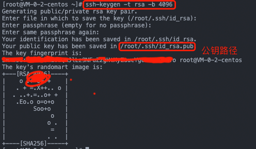
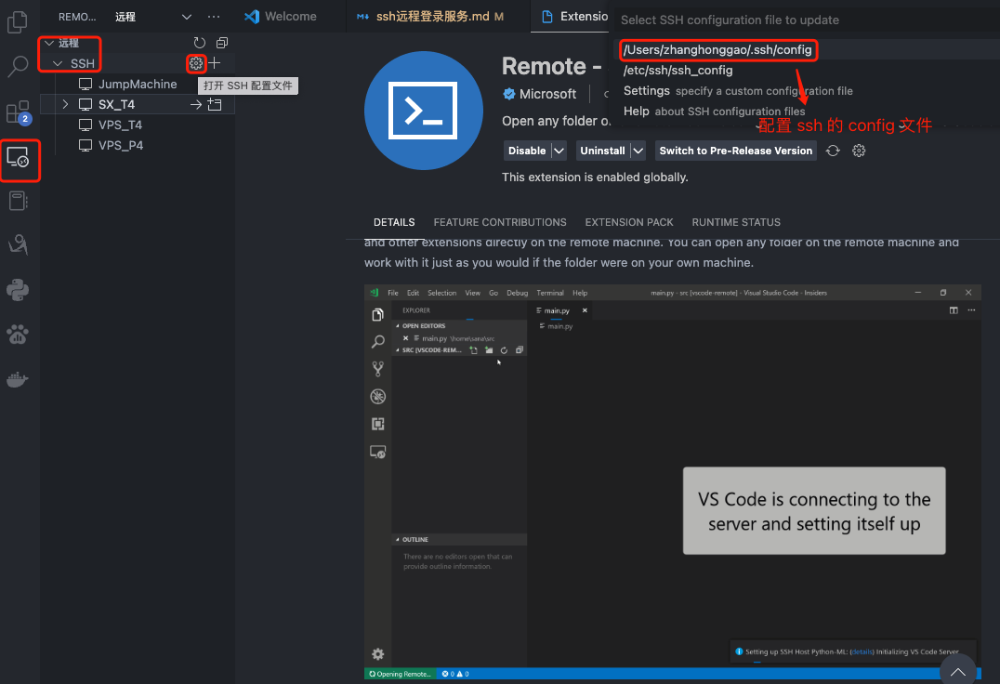

## SSH 概述

`SSH`（安全外壳协议 Secure Shell Protocol，简称SSH）是一种加密的网络传输协议，用于在网络中实现客户端和服务端的连接，典型的如我们在本地电脑通过 `SSH`连接远程服务器，从而做开发，Windows、macOS、Linux都有自带的 `SSH` 客户端，但是在Windows上使用 `SSH` 客户端的体验并不是很好，所以我们一般使用 `Xshell` 来代替。

## 一，准备工作

### 1.1, 安装 SSH 客户端

为了建立 SSH 远程连接，需要两个组件：客户端和相应服务端组件，SSH 客户端是我们安装在本地电脑的软件；而服务端，也需有一个称为 SSH 守护程序的组件，它不断地侦听特定的 TCP/IP 端口以获取可能的客户端连接请求。 一旦客户端发起连接，SSH 守护进程将以软件和它支持的协议版本作为响应，两者将交换它们的标识数据。如果提供的凭据正确，SSH 会为适当的环境创建一个新会话。

MacOS 系统自带 SSH 客户端，可以直接使用，Windows 系统需要安装 `Xshell` 客户端软件，大部分 Linux 发行版系统都自带 SSH 客户端，可以直接使用，可通过 `ssh -V` 命令查看当前系统是否有 SSH 客户端。

```bash
[root@VM-0-2-centos ~]# ssh -V
OpenSSH_7.4p1, OpenSSL 1.0.2k-fips  26 Jan 2017
```

### 1.2, 安装 SSH 服务端

Linux 系统检查 ssh 服务端是否可用的命令有好几种，比如直接看是否有 `ssh` 进程在运行:

```bash
ps -ef | grep ssh
```

运行以上后，输出结果示例如下，有 sshd 进程在运行，说明 ssh 服务端可用。

```bash
-bash-4.3$ ps -e|grep ssh
  336 ?        00:00:00 sshd
  358 ?        00:00:00 sshd
 1202 ?        00:00:00 sshd
 1978 ?        00:00:00 sshd
 1980 ?        00:00:00 sshd
 2710 ?        00:00:00 sshd
 2744 ?        00:00:00 sshd
 2829 ?        00:00:00 sshd
 2831 ?        00:00:00 sshd
 9864 ?        00:00:00 sshd
 9893 ?        00:00:02 sshd
```

对于 Ubuntu 系统，可通过以下命令检查 `OpenSSH` 服务端软件是否可用：

```bash
ssh localhost # 不同 Linux 系统输出可能不一样
```

## 二，基于密码的登录连接

典型用法，只需输入以下命令即可连接远程服务器。
    
```bash
# ssh连接默认端口是22，如果本地机用户名和远程机用户名一致，可以省略用户名
ssh username@host
# 也可以指定连接端口
ssh -p port user@host
```

上述命令是典型的 SSH 连接远程服务器的命令，如果是第一次连接运行后会得到以下提示，正常输入 `yes`，然后输入账号密码即可连接成功:
    
```bash
The authenticity of host '81.69.58.141 (81.69.58.141)' can't be established.
ED25519 key fingerprint is SHA256:QW5nscbIadeqedp7ByOSUF+Z45rxWGYJvAs3TTmTb0M.
This key is not known by any other names
Are you sure you want to continue connecting (yes/no/[fingerprint])? yes

Last login: Tue Feb 28 15:33:06 2023 from xx.xx.xx.xx
```

## 三，基于公钥登录连接

前面的命令是通过密码（私钥）登录，这样比较麻烦，因为每次登录我们都需要**输入密码**，因此我们可以选择 SSH 的公钥登录连接方式，省去输入密码的步骤。

公钥登录的原理，是先在本地机器上生成一对**公钥和私钥**，然后手动把公钥上传到远程服务器。这样每次登录时，远程主机会向用户发送一段随机字符串，而用户会用自己的私钥对这段随机字符串进行加密，然后把加密后的字符串发送给远程主机，远程主机会用用户的公钥对这段字符串进行解密，如果解密后的字符串和远程主机发送的随机字符串一致，那么就认为用户是合法的，允许登录。
只需要把私钥传给远程服务器，远程服务器就可以验证私钥是否是对应的公钥，如果是就允许登录，这样就不需要输入密码了。

SSH 支持多种用于身份验证密钥的公钥算法, 包括 RSA、DSA、ECDSA 和 ED25519 等，其中 RSA 算法是最常用的，因为它是 SSH 协议的默认算法，所以我们这里以 `RSA` 算法为例来生成密钥，并配置免密码远程连接。

`ssh-keygen` 是为 SSH 创建新的身份验证密钥对的工具。此类密钥对用于自动登录、单点登录和验证主机，常用参数定义如下:
- `-t` 参数指定密钥类型
- `-b` 参数指定密钥长度

基于公钥登录连接的具体步骤如下:

1，**本地终端**运行 `ssh-keygen -t rsa -b 4096` 命令生成密钥对，运行后会提示输入密钥保存路径，直接回车即可，保存在默认路径下，然后会提示输入密钥密码，这里我们不设置密码，直接回车即可，然后会提示再次输入密码，这里也不设置密码，直接回车即可，最后会提示密钥生成成功，如下图所示，可以看出 `~/.ssh/` 目录下，会新生成两个文件：`id_rsa.pub` 和 `id_rsa`，分别是公钥和私钥文件。



2，将本地 `.ssh` 目录下的 `id_rsa.pub` 文件内容添加到目标服务器的 `~/.ssh/authorized_keys` 文件中，如果目标服务器没有 `.ssh` 目录，需要先创建 `.ssh` 目录，然后再创建 `authorized_keys` 文件，然后再添加文件内容。

具体操作命令如下:  

```bash
# 1，本地终端运行命令
cat ~/.ssh/id_rsa.pub  # 查看本地公钥文件内容，并复制
# 2，远程终端运行命令，有 authorized_keys 文件则跳过
mkdir -p ~/.ssh  # 创建 .ssh 目录
touch ~/.ssh/authorized_keys  # 创建 authorized_keys 文件
# 3，然后将本地公钥文件内容粘贴到 `authorized_keys` 文件中，保存退出
```

如果觉得上述步骤太过繁琐，可通过下面命令，一键完成公钥登录连接的配置:
    
```bash
$ ssh username@host "mkdir -p ~/.ssh && cat >> ~/.ssh/authorized_keys" < ~/.ssh/id_rsa.pub
```

只要将公钥文件内容写入远程服务器的 `authorized_keys` 的文件，公钥登录的设置就完成了，后续远程连接就不用每次输入密码了！

`Github` 提交代码的时候，也是通过公钥登录连接的方式，只要将本地的公钥文件内容添加到 github 的 `authorized_keys` 文件中，就可以免密码提交代码了，原理是一模一样的。

## 四，VSCode 远程连接

VSCode 也支持远程连接，可以通过 `Remote-SSH` 插件来实现，具体操作步骤如下:

1，在 VSCode 中安装 [Remote-SSH 插件](https://marketplace.visualstudio.com/items?itemName=ms-vscode-remote.remote-ssh)。

2，windows 系统 `ctrel + shift + p` 命令打开命令面板，输入 `Remote-SSH: Connect to Host...`，然后选择 `SSH Configuration`，或者通过左侧菜单栏的 `Remote Explorer` -> `SSH Targets` -> `SSH Configuration` 进入。如下图所示:



3，然后会打开 `~/.ssh/config` 配置文件，可以参考如下所示模板进行配置:

```bash
# Read more about SSH config files: https://linux.die.net/man/5/ssh_config

Host JumpMachine
    HostName jump-vscode.sensetime.com
    # 你跳板机的用户名
    User username

Host T4
    # 目标机的ip地址
    HostName xxx.xxx.xxx.xxx
    # 你目标机的用户名
    User username
    # 目标机登录端口
    Port 22
    # macos系统: ProxyCommand ssh -q -W %h:%p JumpMachine
    ProxyCommand ssh -q -W %h:%p JumpMachine
```

4，本地机生产公钥并追加到远程服务器 `authorized_keys` 中的步骤，参考第三章。

5，配置完成后，保存退出，然后在 VSCode 中，点击左侧菜单栏的 `Remote Explorer` -> `SSH Targets` -> `T4`，即可连接到远程服务器。

## 参考资料

1. [维基百科-Secure Shell](https://zh.wikipedia.org/zh-hans/Secure_Shell)
2. [How to Use ssh-keygen to Generate a New SSH Key?](https://www.ssh.com/academy/ssh/keygen#what-is-ssh-keygen?)
3. [SSH原理与运用（一）：远程登录](https://www.ruanyifeng.com/blog/2011/12/ssh_remote_login.html)