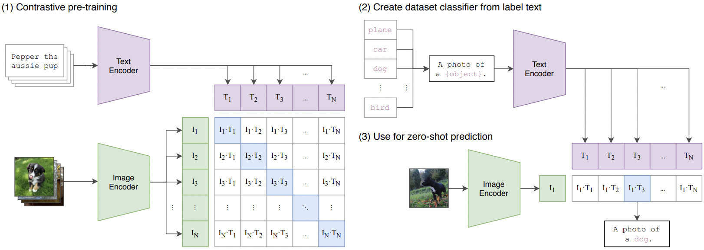

### 背景知识

2021 年见证了 vision transformer 的大爆发，随着谷歌提出 `ViT` 之后，一大批的 vision transformer 的工作席卷计算机视觉任务。除了 vision transformer，另外一个对计算机视觉影响比较大的工作就是 Open AI 在 2021 年1 月份发布的 **DALL-E** 和 **CLIP**，这两个都属于结合图像和文本的多模态模型，其中 **DALL-E 是基于文本来生成图像的模型**，而 **CLIP 是用文本作为监督信号来训练可迁移的视觉模型**。

### CLIP 原理

`CLIP` 的英文全称是 **Contrastive Language-Image Pre-training**，即**一种基于对比文本-图像对的预训练方法或者模型**。CLIP 是一种基于对比学习的多模态模型，与 CV 中的一些对比学习方法如 moco 和 simclr 不同的是，CLIP 的训练数据是**文本-图像对**：一张图像和它对应的文本描述，这里希望通过对比学习，模型能够学习到文本-图像对的匹配关系。

如下图所示，CLIP 包括两个模型：

- `Text Encoder`: 用来提取文本的特征，可以采用 NLP 中常用的 text transformer 模型；
- `Image Encoder`: 用来提取图像的特征，可以使用 CNN 模型（如 ResNet）或者 vision transformer(如 ViT)。



### Vision Transformer

CLIP 分别使用了 ResNet 和 ViT 作为图像编码器，并做了一些改进，这里 ViT 的改进主要有两点：

1. 在 patch embedding 和 position embedding 后添加一个 `LN`;
2. 换了初始化方法。

ViT 共训练了 ViT-B/32，ViT-B/16 以及 ViT-L/14 三个模型。

### CLIP 总结

- CLIP 在自然分布漂移上表现鲁棒，但是依然存在域外泛化问题，即如果测试数据集的分布和训练集相差较大，CLIP 会表现较差；
- CLIP 的 zero-shot 在某些数据集上表现较差，如细粒度分类，抽象任务等；

- CLIP 并没有解决深度学习的数据效率低下难题，训练 CLIP 需要大量的数据；

### 代码分析

`openai` 提供的官方[代码仓库](https://github.com/openai/CLIP)提供了模型的使用代码，如下所示:

```python
import torch
import clip
from PIL import Image

# 检测是否有GPU，如果有就使用GPU，否则使用CPU
device = "cuda" if torch.cuda.is_available() else "cpu"

# 加载 CLIP 模型和预处理函数，使用 ViT-B/32 模型，指定设备为 device
# 这里 preprocess 是 torchvision transform，将 PIL 图像转换为模型要求输入的 tensor 格式
model, preprocess = clip.load("ViT-B/32", device=device)

# 读取图像文件，进行预处理，并转换为模型所需的格式（增加一个 batch 维度），并移动到指定的设备
image = preprocess(Image.open("CLIP.png")).unsqueeze(0).to(device)

# 使用 CLIP 内置的文本 tokenizer 对文本进行编码，并移动到指定的设备
text = clip.tokenize(["a diagram", "a dog", "a cat"]).to(device)

# 禁用梯度计算，提高代码执行效率
with torch.no_grad():
    # 提取图像和文本的特征向量
    image_features = model.encode_image(image)
    text_features = model.encode_text(text)
    
    # 对图像和文本进行分类，得到分类结果，同时进行 softmax 操作，转换为概率值，并将结果移动到 CPU 上进行后续处理
    logits_per_image, logits_per_text = model(image, text)
    probs = logits_per_image.softmax(dim=-1).cpu().numpy()

# 输出分类结果
print("Label probs:", probs)  # prints: [[0.9927937  0.00421068 0.00299572]]
```

#### image encoder 代码分析

这里官方的 image encoder 是通过 `VisionTransformer` 类实现，其实际上就是 `ViT` 模型结构（做了一点改动），熟悉 ViT 模型，自然熟悉 CLIP 模型的 image encoder 结构。下面是代码的一些分析:

1. 代码中通过经过大小为 `patch_size` 的卷积核来代替原文中将大小为 patch_size 的图像块展平后接全连接运算的操作，对应模型结构图中就是 `Embedded Pathces` 操作，输出 shape 是 `[1, 50, 768]`。
2. `x = self.transformer(x)` 和 nlp 中的 transformer 架构中的 encoder 结构一致。
3. `self.positional_embedding`: Positional Encoding，和 nlp 中的 transformer 架构一样，也使用了**位置编码**。不同的是，ViT 中的位置编码没有采用原版 Transformer 中的 $\text{sincos}$ 编码，而是直接设置为可学习的 Positional Encoding。

```python
class VisionTransformer(nn.Module):
    def __init__(self, input_resolution: int, patch_size: int, width: int, layers: int, heads: int, output_dim: int):
        super().__init__()
        self.input_resolution = input_resolution
        self.output_dim = output_dim
        # conv1.weight.shape: torch.Size([768, 3, 32, 32]) (C_out, C_in, kernel_height, kernel_width)
        self.conv1 = nn.Conv2d(in_channels=3, out_channels=width, kernel_size=patch_size, stride=patch_size, bias=False)

        scale = width ** -0.5
        self.class_embedding = nn.Parameter(scale * torch.randn(width)) # torch.Size([768])
        self.positional_embedding = nn.Parameter(scale * torch.randn((input_resolution // patch_size) ** 2 + 1, width)) # torch.Size([50, 768])
        self.ln_pre = LayerNorm(width)

        self.transformer = Transformer(width, layers, heads)

        self.ln_post = LayerNorm(width)
        self.proj = nn.Parameter(scale * torch.randn(width, output_dim))

    def forward(self, x: torch.Tensor): # input x shape torch.Size([1, 3, 224, 224])
        # [B, C, H, W] -> [B, C, H*W] ->[B, H*W, C]
        # shape = [*, grid ** 2, width], [1, 49, 768]， width 实际是 embedding 维度
        x = self.conv1(x).flatten(2).transpose((0, 2, 1)) 
        # shape = [*, grid ** 2 + 1, width]，[1, 50, 768]
        x = torch.cat([self.class_embedding.to(x.dtype) + torch.zeros(x.shape[0], 1, x.shape[-1], dtype=x.dtype, device=x.device), x], dim=1)
        # 将编码向量中加入位置编码，[1, 50, 768]
        x = x + self.positional_embedding.to(x.dtype) 
        x = self.ln_pre(x)

        x = x.permute(1, 0, 2)  # NLD -> LND, torch.Size([50, 1, 768])
        x = self.transformer(x)
        x = x.permute(1, 0, 2)  # LND -> NLD

        x = self.ln_post(x[:, 0, :]) # [1, 768]

        if self.proj is not None:
            x = x @ self.proj

        return x
```

#### text encoder 代码分析


## 参考资料

- [clip code](https://github.com/openai/CLIP)
- [paper: Learning Transferable Visual Models From Natural Language Supervision](https://arxiv.org/abs/2103.00020)