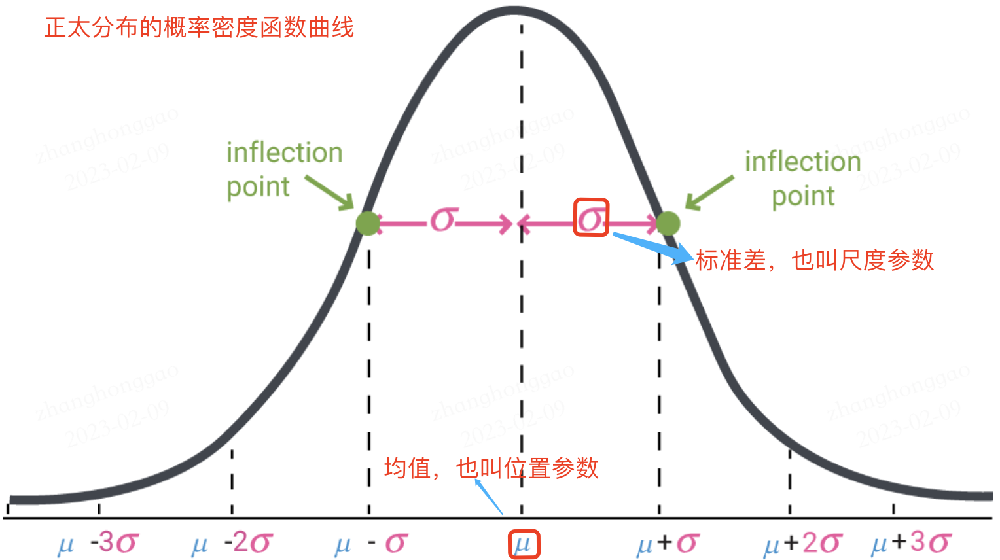
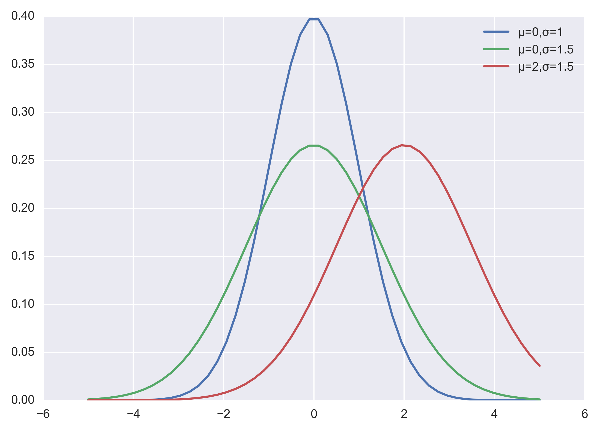
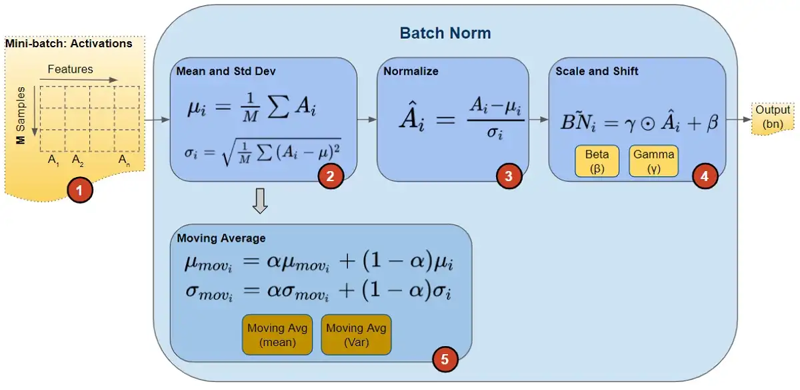
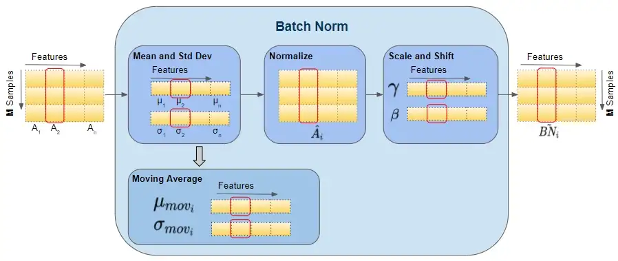

- [一，数学基础](#一数学基础)
  - [1.1，概率密度函数](#11概率密度函数)
  - [1.2，正态分布](#12正态分布)
- [二，背景](#二背景)
  - [2.1，如何理解 Internal Covariate Shift](#21如何理解-internal-covariate-shift)
  - [2.2，Internal Covariate Shift 带来的问题](#22internal-covariate-shift-带来的问题)
  - [2.3，减少 Internal Covariate Shift 的一些尝试](#23减少-internal-covariate-shift-的一些尝试)
- [三，批量归一化（BN）](#三批量归一化bn)
  - [3.1，BN 的前向计算](#31bn-的前向计算)
  - [3.2，BN 层如何工作](#32bn-层如何工作)
  - [3.3，训练和推理式的 BN 层](#33训练和推理式的-bn-层)
  - [3.4，实验](#34实验)
  - [3.5，BN 层的优点](#35bn-层的优点)
- [参考资料](#参考资料)

> 训练深度神经网络的复杂性在于，因为前面的层的参数会发生变化导致每层输入的分布在训练过程中会发生变化。这又导致模型需要需要较低的学习率和非常谨慎的参数初始化策略，从而减慢了训练速度，并且具有饱和非线性的模型训练起来也非常困难。
> 网络层输入数据分布发生变化的这种现象称为内部协变量转移，BN 就是来解决这个问题。
## 一，数学基础

### 1.1，概率密度函数

随机变量（random variable）是可以随机地取不同值的变量。随机变量可以是离散的或者连续的。简单起见，本文用大写字母 $X$ 表示随机变量，小写字母 $x$ 表示随机变量能够取到的值。例如，$x_1$ 和 $x_2$ 都是随机变量 $X$ 可能的取值。随机变量必须伴随着一个概率分布来指定每个状态的可能性。

概率分布（probability distribution）用来描述随机变量或一簇随机变量在每一个可能取到的状态的可能性大小。我们描述概率分布的方式取决于随机变量是离散的还是连续的。

当我们研究的对象是连续型随机变量时，我们用**概率密度函数**（probability density function, `PDF`）而不是概率质量函数来描述它的概率分布。

> 更多内容请阅读《花书》第三章-概率与信息论，或者我的文章-[深度学习数学基础-概率与信息论](https://github.com/HarleysZhang/deep_learning_alchemy/blob/main/1-math_ml_basic/%E6%B7%B1%E5%BA%A6%E5%AD%A6%E4%B9%A0%E6%95%B0%E5%AD%A6%E5%9F%BA%E7%A1%80-%E6%A6%82%E7%8E%87%E4%B8%8E%E4%BF%A1%E6%81%AF%E8%AE%BA.md)。

### 1.2，正态分布

> 当我们不知道数据真实分布时使用正态分布的原因之一是，正态分布拥有最大的熵，我们通过这个假设来施加尽可能少的结构。

实数上最常用的分布就是正态分布(normal distribution)，也称为高斯分布 (Gaussian distribution)。

如果随机变量 $X$ ，服从位置参数为 $\mu$、尺度参数为 $\sigma$ 的概率分布，且其概率密度函数为:

$$
f(x)=\frac{1}{\sigma\sqrt{2 \pi} } e^{- \frac{{(x-\mu)^2}}{2\sigma^2}} \tag{1}
$$
则这个随机变量就称为正态随机变量，正态随机变量服从的概率分布就称**为正态分布**，记作：
$$
X \sim N(\mu,\sigma^2) \tag{2}
$$
如果位置参数 $\mu = 0$，尺度参数 $\sigma = 1$ 时，则称为标准正态分布，记作：
$$
X \sim N(0, 1) \tag{3}
$$
此时，概率密度函数公式简化为:
$$
f(x)=\frac{1}{\sqrt{2 \pi}} e^{- \frac{x^2}{2}} \tag{4}
$$
正太分布的数学期望值或期望值 $\mu$ 等于位置参数，决定了分布的位置；其方差 $\sigma^2$ 的开平方或标准差 $\sigma$ 等于尺度参数，决定了分布的幅度。正太分布的概率密度函数曲线呈钟形，常称之为**钟形曲线**，如下图所示:



可认为构造正太分布函数，也可通过 `np.random.normal` 函数生成指定均值和标准差的正态分布随机数，然后基于 `matplotlib + seaborn` 库 `kdeplot`函数绘制概率密度曲线。示例代码如下所示：

```py
import seaborn as sns
x1 = np.random.normal(0, 1, 100)
x2 = np.random.normal(0, 1.5, 100) 
x3 = np.random.normal(2, 1.5, 100) 

plt.figure(dpi = 200)

sns.kdeplot(x1, label="μ=0, σ=1")
sns.kdeplot(x2, label="μ=0, σ=1.5")
sns.kdeplot(x3, label="μ=2, σ=2.5")

#显示图例
plt.legend()
#添加标题
plt.title("Normal distribution")
plt.show()
```

以上代码直接运行后，输出结果如下图：


当然也可以自己实现正太分布的概率密度函数，代码和程序输出结果如下:

```python
import numpy as np
import matplotlib.pyplot as plt
plt.figure(dpi = 200)
plt.style.use('seaborn-darkgrid') # 主题设置

def nd_func(x, sigma, mu):
  	"""自定义实现正太分布的概率密度函数
  	"""
    a = - (x-mu)**2 / (2*sigma*sigma)
    f = np.exp(a) / (sigma * np.sqrt(2*np.pi))
    return f

if __name__ == '__main__':
    x = np.linspace(-5, 5)
    f = nd_fun(x, 1, 0)
    p1, = plt.plot(x, f)

    f = nd_fun(x, 1.5, 0)
    p2, = plt.plot(x, f)

    f = nd_fun(x, 1.5, 2)
    p3, = plt.plot(x, f)

    plt.legend([p1 ,p2, p3], ["μ=0,σ=1", "μ=0,σ=1.5", "μ=2,σ=1.5"])
    plt.show()
```



## 二，背景

### 2.1，如何理解 Internal Covariate Shift

在深度神经网络训练的过程中，由于网络中参数变化而引起网络中间层数据分布发生变化的这一过程被称在论文中称之为**内部协变量偏移**（Internal Covariate Shift）。

那么，为什么网络中间层数据分布会发生变化呢？

在深度神经网络中，我们可以将每一层视为对输入的信号做了一次变换（暂时不考虑激活，因为激活函数不会改变输入数据的分布）：
$$
Z = W \cdot X + B \tag{5}
$$
其中 $W$ 和 $B$ 是模型学习的参数，这个公式涵盖了全连接层和卷积层。

随着 SGD 算法更新参数，和网络的每一层的输入数据经过公式5的运算后，其 $Z$ 的**分布一直在变化**，因此网络的每一层都需要不断适应新的分布，这一过程就被叫做 Internal Covariate Shift。

而深度神经网络训练的复杂性在于每层的输入受到前面所有层的参数的影响—因此当网络变得更深时，网络参数的微小变化就会被放大。

### 2.2，Internal Covariate Shift 带来的问题

1. 网络层需要不断适应新的分布，**导致网络学习速度的降低**。

2. 网络层输入数据容易陷入到非线性的饱和状态并**减慢网络收敛**，这个影响随着网络深度的增加而放大。

   随着网络层的加深，后面网络输入 $x$ 越来越大，而如果我们又采用 `Sigmoid` 型激活函数，那么每层的输入很容易移动到非线性饱和区域，此时梯度会变得很小甚至接近于 $0$，导致参数的更新速度就会减慢，进而又会放慢网络的收敛速度。

饱和问题和由此产生的梯度消失通常通过使用修正线性单元激活（$ReLU(x)=max(x,0)$），更好的参数初始化方法和小的学习率来解决。然而，如果我们能保证非线性输入的分布在网络训练时保持更稳定，那么优化器将不太可能陷入饱和状态，进而训练也将加速。

### 2.3，减少 Internal Covariate Shift 的一些尝试

1. **白化（Whitening）**: 即输入线性变换为具有零均值和单位方差，并去相关。

   **白化过程由于改变了网络每一层的分布**，因而改变了网络层中本身数据的表达能力。底层网络学习到的参数信息会被白化操作丢失掉，而且白化计算成本也高。

2. **标准化（normalization）**

   Normalization 操作虽然缓解了 `ICS` 问题，让每一层网络的输入数据分布都变得稳定，但却导致了数据表达能力的缺失。

## 三，批量归一化（BN）

### 3.1，BN 的前向计算

论文中给出的 Batch Normalizing Transform 算法计算过程如下图所示。其中输入是一个考虑一个大小为 $m$ 的小批量数据 $\cal B$。


论文中的公式不太清晰，下面我给出更为清晰的  Batch Normalizing Transform 算法计算过程。

设 $m$ 表示 batch_size 的大小，$n$ 表示 features 数量，即样本特征值数量。在训练过程中，针对每一个 `batch` 数据，`BN` 过程进行的操作是，将这组数据 `normalization`，之后对其进行线性变换，具体算法步骤如下:

$$\begin{aligned} 
\mu_B &= \frac{1}{m}\sum_1^m x_i \\
\sigma^2_B &= \frac{1}{m} \sum_1^m (x_i-\mu_B)^2 \\
n_i &= \frac{x_i-\mu_B}{\sqrt{\sigma^2_B + \epsilon}} \\
z_i &= \gamma n_i + \beta = \frac{\gamma}{\sqrt{\sigma^2_B + \epsilon}}x_i + (\beta - \frac{\gamma\mu_{B}}{\sqrt{\sigma^2_B + \epsilon}})
\end{aligned}$$

以上公式乘法都为元素乘，即 `element wise` 的乘法。其中，参数 $\gamma,\beta$ 是训练出来的， $\epsilon$ 是为零防止 $\sigma_B^2$ 为 $0$ ，加的一个很小的数值，通常为`1e-5`。公式各个符号解释如下:

|     符号     |       数据类型       | 数据形状 |
| :----------: | :------------------: | :------: |
|     $X$      |     输入数据矩阵     |  [m, n]  |
|    $x_i$     |  输入数据第i个样本   |  [1, n]  |
|     $N$      | 经过归一化的数据矩阵 |  [m, n]  |
|    $n_i$     |  经过归一化的单样本  |  [1, n]  |
|   $\mu_B$    |      批数据均值      |  [1, n]  |
| $\sigma^2_B$ |      批数据方差      |  [1, n]  |
|     $m$      |      批样本数量      |   [1]    |
|   $\gamma$   |     线性变换参数     |  [1, n]  |
|   $\beta$    |     线性变换参数     |  [1, n]  |
|     $Z$      |   线性变换后的矩阵   |  [1, n]  |
|    $z_i$     |  线性变换后的单样本  |  [1, n]  |
|   $\delta$   |    反向传入的误差    |  [m, n]  |

其中：
$$
z_i = \gamma n_i + \beta = \frac{\gamma}{\sqrt{\sigma^2_B + \epsilon}}x_i + (\beta - \frac{\gamma\mu_{B}}{\sqrt{\sigma^2_B + \epsilon}}) \nonumber
$$
可以看出 `BN` 本质上是做线性变换。

### 3.2，BN 层如何工作

在论文中，训练一个带 `BN` 层的网络， `BN` 算法步骤如下图所示:


在训练期间，我们一次向网络提供一小批数据。在前向传播过程中，网络的每一层都处理该小批量数据。 `BN` 网络层按如下方式执行前向传播计算：



> 图片来源[这里](https://towardsdatascience.com/batch-norm-explained-visually-how-it-works-and-why-neural-networks-need-it-b18919692739)。

注意，图中计算均值与方差的无偏估计方法是吴恩达在 Coursera 上的 Deep Learning 课程上提出的方法：对 train 阶段每个 batch 计算的 mean/variance 采用**指数加权平均**来得到 test 阶段 mean/variance 的估计。

在训练期间，它只是计算此 EMA，但不对其执行任何操作。在训练结束时，它只是将该值保存为层状态的一部分，以供在推理阶段使用。

如下图可以展示BN 层的前向传播计算过程数据的 `shape` ，红色框出来的单个样本都指代单个矩阵，即运算都是在单个矩阵运算中计算的。



> 图片来源 [这里](https://towardsdatascience.com/batch-norm-explained-visually-how-it-works-and-why-neural-networks-need-it-b18919692739)。

BN 的反向传播过程中，会更新 BN 层中的所有 $\beta$ 和 $\gamma$ 参数。

### 3.3，训练和推理式的 BN 层

批量归一化（batch normalization）的“批量”两个字，表示在模型的迭代训练过程中，BN 首先计算小批量（ mini-batch，如 32）的均值和方差。但是，在推理过程中，我们只有一个样本，而不是一个小批量。在这种情况下，我们该如何获得均值和方差呢？

第一种方法是，使用的均值和方差数据是在训练过程中样本值的平均，即：

$$\begin{align}
E[x] &= E[\mu_B] \nonumber \\
Var[x] &= \frac{m}{m-1} E[\sigma^2_B] \nonumber \\
\end{align}$$

这种做法会把所有训练批次的 $\mu$ 和 $\sigma$ 都保存下来，然后在最后训练完成时（或做测试时）做下平均。

第二种方法是使用类似动量的方法，训练时，加权平均每个批次的值，权值 $\alpha$ 可以为0.9：

$$\begin{aligned}
\mu_{mov_{i}} &= \alpha \cdot \mu_{mov_{i}} + (1-\alpha) \cdot \mu_i \nonumber \\
\sigma_{mov_{i}} &= \alpha \cdot \sigma_{mov_{i}} + (1-\alpha) \cdot \sigma_i \nonumber \\
\end{aligned}$$

推理或测试时，直接使用模型文件中保存的 $\mu_{mov_{i}}$ 和 $\sigma_{mov_{i}}$ 的值即可。

### 3.4，实验

`BN` 在 `ImageNet` 分类数据集上实验结果是 `SOTA` 的，如下表所示:


### 3.5，BN 层的优点

1. **BN 使得网络中每层输入数据的分布相对稳定，加速模型训练和收敛速度**。
2. **批标准化可以提高学习率**。在传统的深度网络中，学习率过高可能会导致梯度爆炸或梯度消失，以及陷入差的局部最小值。批标准化有助于解决这些问题。通过标准化整个网络的激活值，它可以防止层参数的微小变化随着数据在深度网络中的传播而放大。例如，这使 sigmoid 非线性更容易保持在它们的非饱和状态，这对训练深度 sigmoid 网络至关重要，但在传统上很难实现。

3. **BN 允许网络使用饱和非线性激活函数（如 sigmoid，tanh 等）进行训练，其能缓解梯度消失问题**。
4. 不需要 `dropout` 和 `LRN`（Local Response Normalization）层来实现正则化。批标准化提供了类似丢弃的正则化收益，因为通过实验可以观察到训练样本的激活受到同一小批量样例随机选择的影响。
5. **减少对参数初始化方法的依赖**。

## 参考资料

1. [维基百科-正态分布](https://zh.wikipedia.org/zh-hans/%E6%AD%A3%E6%80%81%E5%88%86%E5%B8%83)
2. [Batch Norm Explained Visually — How it works, and why neural networks need it](https://towardsdatascience.com/batch-norm-explained-visually-how-it-works-and-why-neural-networks-need-it-b18919692739)
3. [15.5 批量归一化的原理](https://microsoft.github.io/ai-edu/%E5%9F%BA%E7%A1%80%E6%95%99%E7%A8%8B/A2-%E7%A5%9E%E7%BB%8F%E7%BD%91%E7%BB%9C%E5%9F%BA%E6%9C%AC%E5%8E%9F%E7%90%86/%E7%AC%AC7%E6%AD%A5%20-%20%E6%B7%B1%E5%BA%A6%E7%A5%9E%E7%BB%8F%E7%BD%91%E7%BB%9C/15.5-%E6%89%B9%E9%87%8F%E5%BD%92%E4%B8%80%E5%8C%96%E7%9A%84%E5%8E%9F%E7%90%86.html)
4. [Batch Normalization原理与实战](https://zhuanlan.zhihu.com/p/34879333)