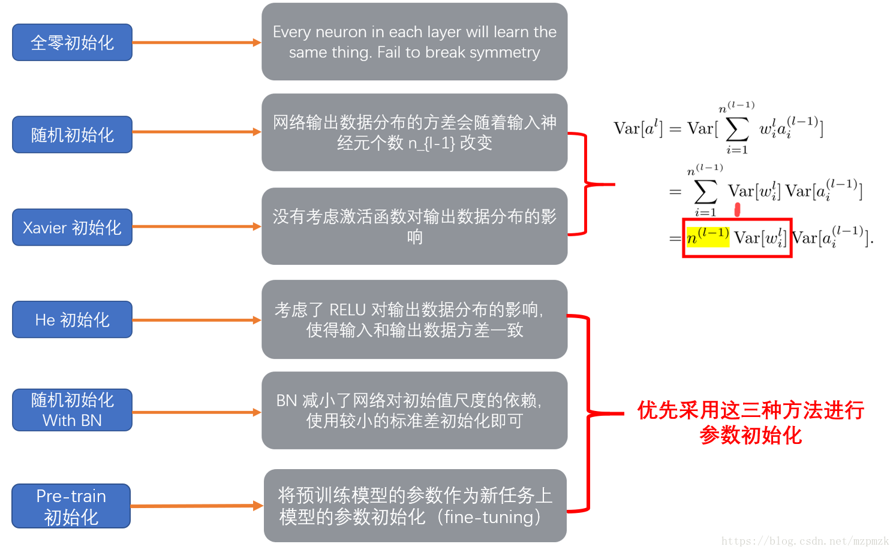

> 本文内容参考资料为《深度学习》和《解析卷积神经网络》两本书，以及部分网络资料。

## 前言

我们知道神经网络模型一般是依靠**随机梯度下降**优化算法进行模型训练和模型参数更新的，模型的最终性能与收敛得到的最优解直接相关，而收敛效果实际上又很大程度取决于网络参数最开始初始化。

## 一，网络参数初始化概述

首先得明确的是现代的**网络参数初始化策略**是简单的、启发式的。设定改进的初始化策略是一项困难的 任务，因为神经网络优化至今还未被很好地理解（即模型训练过程是一个黑盒）。

大多数初始化策略基于在神经网 络初始化时实现一些很好的性质。然而，我们并没有很好地理解这些性质中的哪些会在学习开始进行后的哪些情况下得以保持。进一步的难点是，有些初始点从优化的观点看或许是有利的，但是从泛化的观点看是不利的。我们对于初始点如何影响泛化的理解是相当原始的，几乎没有提供如何选择初始点的任何指导。

目前也许完全确知的唯一特性是初始参数需要在不同单元间 **“破坏对称性”**。因为如果不同神经元的初始化参数相同，不同神经元的输出也必然相同，相同输出则导致梯度更新完全一样，即更新后的参数依然和之前一样，无法进行模型训练了。
### 1.1，进行网络参数初始化的原因

深度学习模型（神经网络模型）的训练算法通常是**迭代**的，因此模型训练者需要指定开始迭代的初始点，即择网络参数初始化策略。

### 1.2，网络参数初始化为什么重要

训练深度学习模型是一个足够困难的问题，以至于大多数算法都很大程度受到网络初始化策略的影响。

迭代的初始点能够决定算法是否收敛，有些初始点十分不稳定，使得该 算法会遭遇数值困难，并完全失败。当学习收敛时，初始点可以决定学习收敛得多快，以及是否收敛到一个代价高或低的点。另外，即使是具有同一个损失代价的迭代点也会有差别极大的泛化误差，而迭代初始点也可以影响泛化（误差）。

### 1.3，有效的初始化策略

在实际应用中，模型权重参数服从**高斯分布**（`Gaussian distribution`）或**均匀分布**（`uniform distribution`）都是较为**有效**的初始化方式。值得注意的是，这两种分布选择的区别，目前还没有被详尽的研究清楚，能够确定只有，初始分布的大小确实对优化过程的结果和网络泛化能力都有很大的影响。
> 权重初始化随机值的初始化策略的分布都对模型性能有影响，但是影响的原理（神经网络优化原理）又没有被彻底研究清楚，所谓模型训练，还真不愧是炼丹，部分时候还真得靠炼丹人的技巧。

## 二，权重初始化方式分类

常用的网络参数初始化方式有全零初始化、随机初始化、Xaxier初始化、He初始化、随机初始化With BN、Pre-train初始化，特性如下图所示（来源于网络）。

## 2.1，全零初始化

通过合理的数据预处理和规范化，当网络收敛到稳定状态时，参数（权值）在理想情况下应基本保持正负各半的状态（此时期望（平均值）为 0 ）。全零初始化参数可使得初始化时参数得期望（expectation）与网络稳定时参数的期望一致为零。但是，实际上参数全为0时网络不同神经元的输出必然相同，输出相同则导致梯度更新完全一样，这样直接导致了网络神经元无法改变，也就无法训练。

### 2.2，随机初始化

我们希望所有参数的**期望接近 0**。遵循这个原则，可以将参数设置为接近 0 的很小的随机数（有正有负），在实际中，随机参数服从高斯分布/正态分布（Gaussian distribution / normal distribution）和均匀分布（uniform distribution）都是有效的初始化方法。

## 2.3，Xavier 初始化

权重参数随机初始化会带来一个问题，即网络输出数据分布的方差会随着输入神经元个数改变，为解决这一问题，会在初始化的同时加上对方差大小的规划化，`Glorot`提出了`Xavier`初始化方式，其中服从高斯分布的`Xavier`初始化公式如下：

$$
w =  0.001*randn(n_{in}， n_{out})*stdev ，(stdev=sqrt(1/n))
$$

### 2.4，He 初始化

`Xavier` 方法未考虑非线性映射函数对输入`s`（未经过激活函数的网络层输出结果）的影响，使用如`RELU`等非线性映射函数后，输出的期望往往不再为 0 ，为解决这个问题，2015 年 He 等人提出改进-将非线性映射造成的影响考虑进参数初始化中，其中服从高斯分布的`He`初始化公式如下：
$$w = 0.001*randn(n_{in}， n_{out})*stdev ，(stdev=sqrt(2/n))$$

### 总结

1. 使用 `RELU（without BN）` 激活函数时，最好选用 `He` 初始化方法，将参数初始化为服从高斯分布或者均匀分布的较小随机数
2. 使用 `BN` 时，减少了网络对参数初始值尺度的依赖，此时使用较小的标准差(eg：`0.01`)进行初始化即可
3. 借助预训练模型中参数作为新任务参数初始化的方式也是一种简便易行且十分有效的模型参数初始化方法

## 参考资料

- 《深度学习-8.4 参数初始化策略》
- 《解析卷积神经网络-章 7 网络参数初始化》
- [神经网络之权重初始化](https://www.cnblogs.com/makefile/p/init-weight.html)