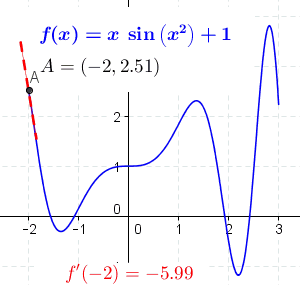
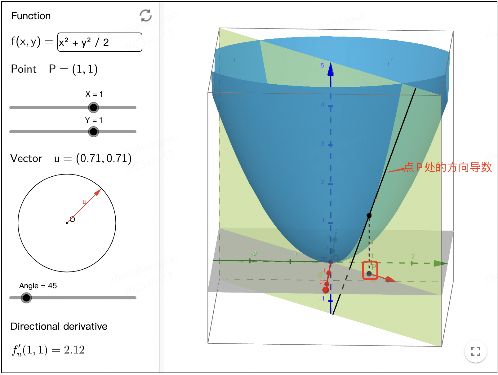
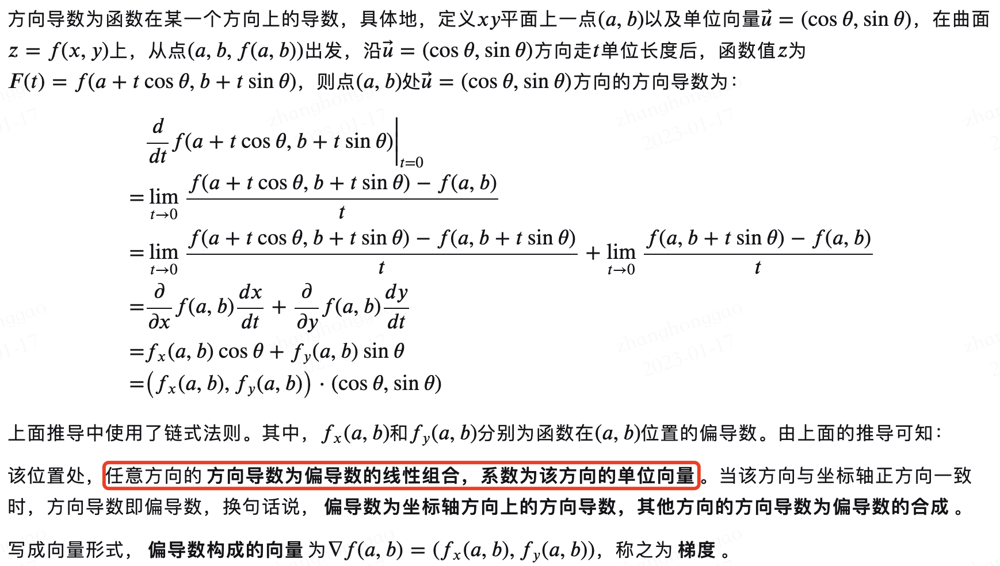

> 梯度是微积分中的基本概念，也是机器学习解优化问题经常使用的数学工具（梯度下降算法）。因此，有必要从头理解梯度的来源和意义。本文从导数开始讲起，讲述了导数、偏导数、方向导数和梯度的定义、意义和数学公式，有助于初学者后续更深入理解随机梯度下降算法的公式。大部分内容来自维基百科和博客文章内容的总结，并加以个人理解。

## 导数

导数（英语：`derivative`）是微积分学中的一个概念。函数在某一点的导数是指这个函数在这一点附近的**变化率**。导数的本质是通过极限的概念对函数进行局部的线性逼近。当函数 $f$ 的自变量在一点 $x_0$ 处产生一个增量时 $h$ 时，函数输出值的增量与自变量增量 $h$ 的比值在 $h$ 趋于 0 时的极限如果存在，则将这个比值定义为 $f$ 在 $x_0$ 处的导数，记作 $f'(x_0)$、$\frac{\mathrm{d}f}{\mathrm{d}x}(x_0)$ 或 $\left.\frac{\mathrm{d}f}{\mathrm{d}x}\right|_{x=x_0}$

导数是函数的局部性质。不是所有的函数都有导数，一个函数也不一定在所有的点上都有导数。若某函数在某一点导数存在，则称其在这一点可导(可微分)，否则称为不可导(不可微分)。如果函数的自变量和取值都是实数的话，那么函数在某一点的导数就是该函数所代表的曲线在这一点上的切线斜率。

对于可导的函数 $f$，$x \mapsto f'(x)$ 也是一个函数，称作 $f$ 的导函数。导数示例如下图所示:

导数的一般定义如下:

如果实函数 $f$ 在点 $a$ 的某个领域内有定义，且以下极限（注意这个表达式所定义的函数定义域不含 $a$ ）

$$
{\displaystyle \lim _{x\to a}{\frac {f(x)-f(a)}{x-a}}}
$$

存在，则称 $f$ 于 $a$ 处可导，并称这个极限值为 $f$于$a$ 处的导数，记作 $f'(a)$。

## 偏导数
> 偏导数的作用与价值在向量分析和微分几何以及机器学习领域中受到广泛认可。

导数是一元函数的变化率（斜率），导数也是函数，可以理解为函数的变化率与位置的关系。

那么如果是多元函数的变化率问题呢？答案是**偏导数**，定义为**多元函数沿坐标轴的变化率**。

偏导数是多元函数“退化”成一元函数时的导数，这里“退化”的意思是固定其他变量的值，只保留一个变量，依次保留每个变量，则 $N$ 元函数有 $N$ 个偏导数。

如果一个变量对应一个坐标轴，那么偏导数可以理解为函数在每个位置处沿着自变量坐标轴方向上的导数（切线斜率）。

在数学中，偏导数（英语：`partial derivative`）的定义是：一个**多变量**的函数（或称多元函数），**对其中一个变量（导数）微分，而保持其他变量恒定**。函数 $f$ 关于变量 $x$ 的偏导数记为 $f'(x)$ 或 $\frac{\partial f}{\partial x}$。偏导数符号 $\partial $ 是全导数符号 $d$ 的变体。

假设 $f$ 是一个多元函数。例如：

$$z = f(x, y) = x^2 + xy + y^2$$

我们把变量 $y$ 视为常数，通过对方程求导，我们可以得到**函数 $f$ 关于变量 $x$ 的偏导数**:

$${\displaystyle {\frac {\partial f}{\partial x}} = 2x + y}$$

同理可得，函数 $f$ 关于变量 $y$ 的偏导数:

$${{\frac {\partial f}{\partial y}} = x + 2y}$$

## 方向导数

在前面导数和偏导数的定义中，均是**沿坐标轴正方向讨论函数的变化率**。那么当我们讨论函数沿任意方向的变化率时，也就引出了方向导数的定义，即：**某一点在某一趋近方向上的导数值**。

通俗理解就是：我们不仅要知道函数在坐标轴正方向上的变化率（即偏导数），而且还要设法求得函数在其他特定方向上的变化率（方向导数）。如下图所示，点 $P$ 位置处红色箭头方向的方向导数为黑色切线的斜率。图片来自链接 [Directional Derivative](https://www.geogebra.org/m/Bx8nFMNc)。

方向导数的定义参考下图，来源-[直观理解梯度，以及偏导数、方向导数和法向量等](https://www.cnblogs.com/shine-lee/p/11715033.html)。

## 梯度

在向量微积分中，梯度（英语：`gradient`）是一种关于多元导数的概括。平常的一元（单变量）函数的导数是标量值函数，而多元函数的梯度是**向量值**函数。

就像一元函数的导数表示这个函数图形的切线的斜率，如果多元函数在点 $P$ 上的梯度不是零向量，则它的方向是这个函数在 $P$ 上最大增长的方向、而它的量是在这个方向上的**增长率**。

梯度，写作 $\nabla f$ 或 grad $f$，二元时为($\frac{\partial f(x,y)}{\partial x}, \frac{\partial f(x,y)}{\partial y}$)。梯度是微积分中的基本概念，也是机器学习解优化问题经常使用的数学工具（梯度下降算法）。借助前面方向导数的推导公式，我们可以得到 $xy$ 平面上一点 $(a,b)$ 处 $\theta$ 方向上的方向导数和其意义如下图:

可以从以下两个实例理解**梯度意义**：

1. 假设有一个房间，房间内所有点的温度由一个标量场 $\phi$ 给出的，即点 $(x,y,z)$ 的温度是 $\phi(x,y,z)$。假设温度不随时间改变。然后，在房间的每一点，该点的梯度将显示变热最快的方向。梯度的大小将表示在该方向上的温度变化率。

2. 考虑一座高度函数为 $H$ 的山，山上某点 $(x, y)$ 的高度是 $H(x, y)$，点 $(x,y)$ 的梯度是在该点坡度（或者说斜度）最陡的方向。梯度的大小会告诉我们坡度到底有多陡。

总结梯度的几何意义：

- 当前位置的**梯度方向**，为函数在该位置处方向导数最大的方向，也是函数值上升最快的方向，反方向为下降最快的方向；
- 当前位置的**梯度长度**（模），为最大方向导数的值。

## 总结

- 方向导数是各个方向上的导数。
- 偏导数连续才有梯度存在。
- 偏导数构成的向量为梯度。
- **梯度的方向是方向导数中取到最大值的方向**，梯度的值是方向导数的最大值。

## 参考资料

1. [维基百科-偏导数](https://zh.m.wikipedia.org/zh-hans/%E5%81%8F%E5%AF%BC%E6%95%B0)
2. [直观理解梯度，以及偏导数、方向导数和法向量等](https://www.cnblogs.com/shine-lee/p/11715033.html)
3. [AI-EDU: 09.4 神经网络非线性回归的实现](https://microsoft.github.io/ai-edu/%E5%9F%BA%E7%A1%80%E6%95%99%E7%A8%8B/A2-%E7%A5%9E%E7%BB%8F%E7%BD%91%E7%BB%9C%E5%9F%BA%E6%9C%AC%E5%8E%9F%E7%90%86/%E7%AC%AC4%E6%AD%A5%20-%20%E9%9D%9E%E7%BA%BF%E6%80%A7%E5%9B%9E%E5%BD%92/09.4-%E7%A5%9E%E7%BB%8F%E7%BD%91%E7%BB%9C%E9%9D%9E%E7%BA%BF%E6%80%A7%E5%9B%9E%E5%BD%92%E7%9A%84%E5%AE%9E%E7%8E%B0.html)

