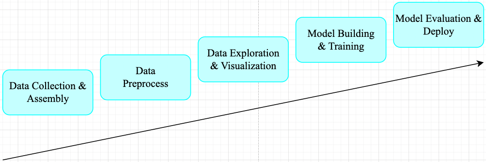
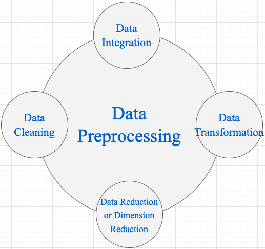
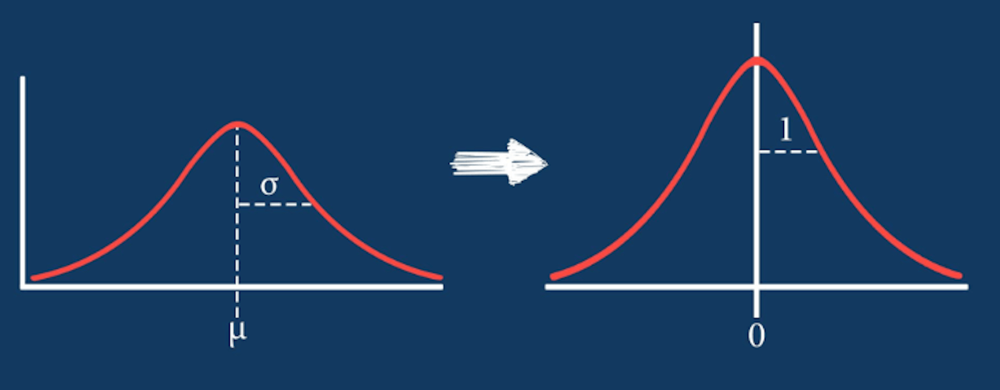
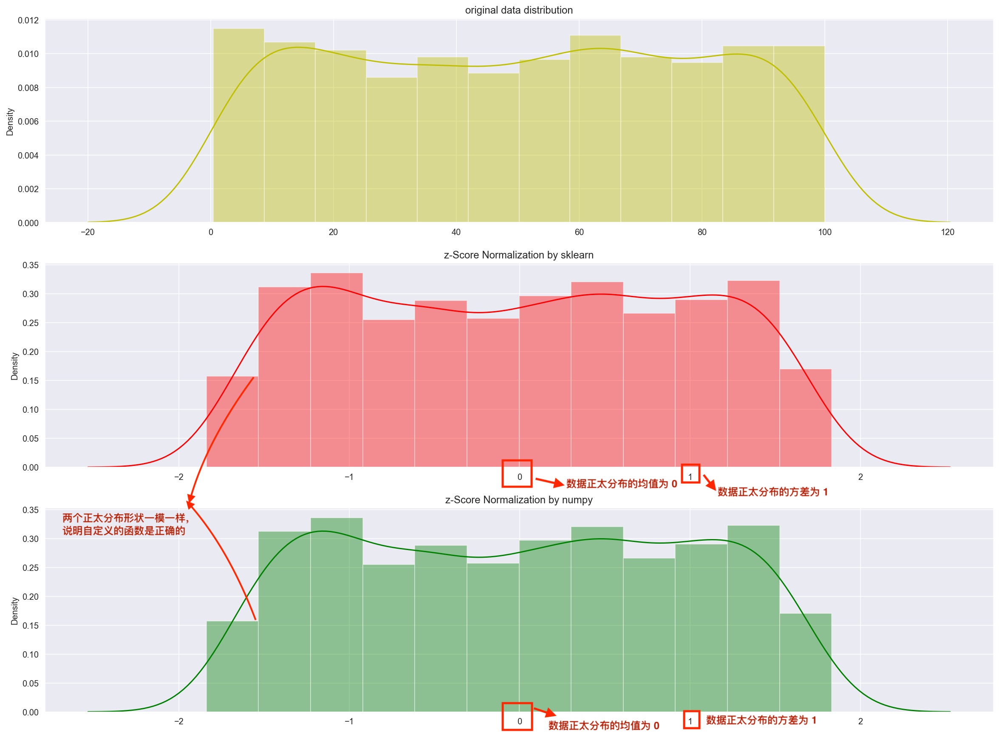

- [前言](#前言)
- [一，Normalization 概述](#一normalization-概述)
  - [1.1，Normalization 定义](#11normalization-定义)
  - [1.2，什么情况需要 Normalization](#12什么情况需要-normalization)
  - [1.3，为什么要做 Normalization](#13为什么要做-normalization)
  - [1.4，Data Normalization 常用方法](#14data-normalization-常用方法)
  - [1.5，代码实现](#15代码实现)
- [二，normalize images](#二normalize-images)
  - [2.1，图像 normalization 定义](#21图像-normalization-定义)
  - [2.2，图像 normalization 的好处](#22图像-normalization-的好处)
  - [2.3，PyTorch 实践图像 normalization](#23pytorch-实践图像-normalization)
- [参考资料](#参考资料)

## 前言

一般机器学习任务其工作流程可总结为如下所示 `pipeline`。



在工业界，**数据预处理**步骤对模型精度的提高的发挥着重要作用。对于机器学习任务来说，广泛的数据预处理一般有四个阶段（**视觉任务一般只需 `Data Transformation`**）: 数据清洗(Data Cleaning)、数据整合(Data Integration)、数据转换(Data Transformation)和数据缩减(Data Reduction)。



1，`Data Cleaning`： 数据清理是数据预处理步骤的一部分，通过填充缺失值、平滑噪声数据、解决不一致和删除异常值来清理数据。

2，`Data Integration`： 用于将存在于多个源中的数据合并到一个更大的数据存储中，如数据仓库。例如，将来自多个医疗节点的图像整合起来，形成一个更大的数据库。

3，`Data Transformation ` : 在完成 `Data Cleaning` 后，我们需要使用以下**数据转换策略**更改数据的值、结构或格式。

- `Generalization`: 使用概念层次结构将低级或粒度数据转换为高级信息。例如将城市等地址中的原始数据转化为国家等更高层次的信息。
- `Normalization`: 目的是将数字属性按比例放大或缩小以适合指定范围。`Normalization` 常见方法:
  - `Min-max normalization`：将数据映射到 $[0,1]$ 区间。
  - `Z-Score normalization`：把每个特征值中的所有数据，变成平均值为0，标准差为1的数据，最后为正态分布。
  - Decimal scaling normalization

4，`Data Reduction` 数据仓库中数据集的大小可能太大而无法通过数据分析和数据挖掘算法进行处理。一种可能的解决方案是获得数据集的缩减表示，该数据集的体积要小得多，但会产生相同质量的分析结果。常见的数据缩减策略如下:
- `Data cube aggregation`
- `Dimensionality reduction`: **降维技术用于执行特征提取**。数据集的维度是指数据的属性或个体特征。该技术旨在减少我们在机器学习算法中考虑的冗余特征的数量。降维可以使用主成分分析（`PCA`）等技术来完成。
- `Data compression`: 通过使用编码技术，数据的大小可以显着减小。
- `Discretization`: 数据离散化用于**将具有连续性的属性划分为具有区间的数据**。这样做是因为连续特征往往与目标变量相关的可能性较小。例如，属性年龄可以离散化为 18 岁以下、18-44 岁、44-60 岁、60 岁以上等区间。

对于计算机视觉任务来说，在训练 `CNN` 模型之前，对于输入样本特征数据做**标准化**（`normalization`，也叫归一化）**预处理**（`data preprocessing`）操作是最常见的步骤。


## 一，Normalization 概述

> 后续内容对 Normalization 不再使用中文翻译，是因为目前中文翻译有些歧义，根据我查阅的博客资料，翻译为“归一化”比较多，但仅供可参考。

### 1.1，Normalization 定义

`Normalization` 操作被用于对数据属性进行缩放，使其落在较小的范围之内（即变化到某个固定区间中），比如 [-1,1] 和 [0, 1]，简单理解就是**特征缩放**过程。很多机器学习算法都受益于 `Normalization` 操作，比如:

- 通常对分类算法有用。
- 在梯度下降等机器学习算法的核心中使用的优化算法很有用。
- 对于加权输入的算法（如回归和神经网络）以及使用距离度量的算法（如 K 最近邻）也很有用。

### 1.2，什么情况需要 Normalization

当我们处理的**数据具有不同尺度（范围）**（`different scale`）时，通常就需要进行 `normalization` 操作了。

数据具有不同尺度的情况会导致一个重要属性（在较低尺度上）的有效性被稀释，因为其他属性可能具有更大范围（尺度）的值，简单点理解就是**范围（`scale`）大的属性在模型当中更具优先级**，具体示例如下图所示。


总结起来就是，当数据存在多个属性但其值具有不同尺度（`scale`）时，这可能会导致我们在做数据挖掘操作时数据模型表现不佳，因此这时候执行 `normalization` 操作将所有属性置于相同的尺寸内是很有必要的。

### 1.3，为什么要做 Normalization

1. **样本的各个特征的取值要符合概率分布**，即 $[0,1]$（也可理解为降低模型训练对**特征尺度**的敏感度）。输入数据特征取值范围和输出标签范围一样，从损失函数等高线图来分析，不做 Normalization 的训练过程会更曲折。

   

2. 神经网络假设所有的输入输出数据都是**标准差为1，均值为0**，包括权重值的初始化，激活函数的选择，以及优化算法的设计。

3. 避免一些不必要的**数值问题**。

   因为激活函数 sigmoid/tanh 的非线性区间大约在 [−1.7，1.7]。意味着要使神经元的激活函数有效，线性计算输出的值的数量级应该在1（1.7所在的数量级）左右。这时如果输入较大，就意味着权值必须较小，一个较大，一个较小，两者相乘，就引起数值问题了。

4. **梯度更新**。

   若果输出层的数量级很大，会引起损失函数的数量级很大，这样做反向传播时的梯度也就很大，这时会给梯度的更新带来数值问题。

5. **学习率**。

   特征数据数值范围不同，正确的梯度更新方向需要的学习率也会不同（如果梯度非常大，学习率就必须非常小），即不同神经元权重 $w_1$、$w_2$ 所需的学习率也不同。因此，学习率（学习率初始值）的选择需要参考输入的范围，这样不如**直接将数据标准化，这样学习率就不必再根据数据范围作调整**。

### 1.4，Data Normalization 常用方法

1，`z-Score Normalization`

zero-mean Normalization，有时也称为 standardization，将数据特征缩放成均值为 0，方差为 1 的分布，对应公式: 

$$
{x}' = \frac{x-mean(x)}{\sigma}
$$

其中：
- $x$：原始值
- $mean(x)$：表示变量 $x$ 的均值（有些地方用 $\mu =\frac{1}{N}\sum_{i=1}^{N} x_i$）
- $\sigma$: 表示变量的标准差（总体标准差数学定义 $\sigma = \sqrt{\frac{1}{N} \sum_{i=1}^{N}(x_i - \mu)^2}$ ）
- ${x}'$ 是数据缩放后的新值

经过 zero-mean Normalization 操作之后的数据正态分布函数曲线图会产生如下所示转换。



其中，正态分布函数曲线中均值和标准差值的确定参考下图。


2，`Min-Max Normalization`

执行线性操作，将数据范围缩放到 $[0，1]$ 区间内，对应公式: 

$$
{x}' = \frac{x - min(x)}{max(x) - min(x)}
$$

其中 $max(x)$ 是变量最大值，$min(x)$ 是变量最小值。

### 1.5，代码实现

z-Score Normalization 方法既可以调用相关 python 库的 `api` 实现，也可以自己实现相关功能。

以下是使用  sklearn 相关类和基于 numpy 库实现 `z-Score Normalization` 功能，并给出数据直方图对比的示例代码。

> 代码不是特别规范，仅供参考，当作功能理解和实验测试用。

```py
## 输出高清图像
%config InlineBackend.figure_format = 'retina'
%matplotlib inline
import numpy as np
from sklearn import preprocessing
import matplotlib.pyplot as plt
%matplotlib inline
import seaborn as sns

np.random.seed(42)

plt.figure(dpi = 200)
plt.figure(figsize=(20, 15))
# X_train = np.array([[ 10., -1.7,  21.4],
#                     [ 2.4,  0.,  0.6],
#                     [ 0.9,  1., -1.9]])
# 生成指定 size 和 范围 [low,high) 的随机浮点数
X_train = np.random.uniform(low=0.0, high=100.0, size = (100, 15))
# 1, 绘制原始数据的直方图
plt.subplot(3, 1, 1)
plt.title("original data distribution")
sns.distplot(X_train, color='y')

# 2， 应用 sklearn 库的 z-Score Normalization 类，并绘制直方图
scaler = preprocessing.StandardScaler().fit(X_train)
X_scaled = scaler.transform(X_train)
plt.subplot(3, 1, 2)
plt.title("z-Score Normalization by sklearn")
sns.distplot(X_scaled, color='r')

# 3，利用 numpy 函数实现 z-Score Normalization，并绘制直方图
def z_Score_Normalization(data):
    data_mat = np.array(data)
    data_z_np = (data_mat - np.mean(data_mat, axis=0)) / np.std(data_mat, axis=0)
    return data_z_np

data_scaled = z_Score_Normalization(X_train)
plt.subplot(3, 1, 3)
plt.title("z-Score Normalization by numpy")
sns.distplot(data_scaled, color='g')
```

程序输出结果如下。可以看出经过 z-Score Normalization 操作之后，原始数据的分布转化成平均值为 $\mu=0$，标准差为 $\sigma = 1$ 的正太分布（称为**标准正态分布**）。



Min-Max Normalization 方法的实现比较简单，以下是基于 numpy 库实现 `Min-Max Normalization` 功能的示例代码：

```python
# 导入必要的库
import numpy as np
# 定义数据集
X = np.array([[1, 2, 3], [4, 5, 6], [7, 8, 9]])
def Min_Max_Normalization(X):
    # 计算数据集的最小值和最大值
    Xmin = X.min()
    Xmax = X.max()
    # 计算最小-最大规范化
    X_norm = (X - Xmin) / (Xmax - Xmin)
    return X_norm
# 打印结果
print(Min_Max_Normalization(X))
```

程序输出结果如下，可以看出原始数组数据都被缩放到 $[0, 1]$ 范围内了。


## 二，normalize images

### 2.1，图像 normalization 定义

当我们使用卷积神经网络解决计算机视觉任务时，一般需要对输入图像数据做 `normalization` 来完成预处理工作，常见的图像 `normalization` 方法有两种: `min-max normalization` 和 `zero-mean normalization`。

1，以单张图像的 `zero-mean Normalization` 为例，它使得图像的均值和标准差分别变为 `0.0` 和 `1.0`。因为是多维数据，与纯表格数据不同，它**首先需要从每个输入通道中减去通道平均值，然后将结果除以通道标准差**。因此可定义两种 normalization 形式如下所示:

```shell
# min-max Normalization
output[channel] = (input[channel] - min[channel]) / (max[channel] - min[channel])
# zero-mean Normalization
output[channel] = (input[channel] - mean[channel]) / std[channel]
```

### 2.2，图像 normalization 的好处

图像 `normalization` 有助于使数据处于一定范围内并**减少偏度**（`skewness`），从而**有助于模型更快更好地学习**。归一化还可以解决梯度递减和爆炸的问题。

### 2.3，PyTorch 实践图像 normalization

在 `Pytorch` 框架中，图像变换（image transformation）是指**将图像像素的原始值改变为新值的过程**。其中常见的 `transformation` 操作是使用 torchvision.transforms.ToTensor() 方法将图像变换为 Pytorch 张量（`tensor`），它实现了将像素范围为 [0, 255] 的 `PIL` 图像转换为形状为（C,H,W）且范围为 [0.0, 1.0] 的 Pytorch FloatTensor。另外，torchvision.transforms.normalize() 方法实现了逐 channel 的对图像进行标准化（均值变为 0，标准差变为 1）。总结如下: 

- `min-max Normalization`: 对应 `torchvision.transforms.ToTensor()` 方法
- `zero-mean Normalization`: 对应 `torchvision.transforms.Normalize()` 方法，利用用均值和标准差对张量图像进行 zero-mean Normalization。

`ToTensor()` 函数的语法如下:
```shell
"""
Convert a ``PIL Image`` or ``numpy.ndarray`` to tensor.
Converts a PIL Image or numpy.ndarray (H x W x C) in the range
[0, 255] to a torch.FloatTensor of shape (C x H x W) in the range [0.0, 1.0].

Args:
    pic (PIL Image or numpy.ndarray): Image to be converted to tensor.
Returns:
    Tensor: Converted image.
"""
```

`Normalize()` 函数的语法如下:

```shell
Syntax: torchvision.transforms.Normalize()

Parameter:
    * mean: Sequence of means for each channel.
    * std: Sequence of standard deviations for each channel.
    * inplace: Bool to make this operation in-place.
Returns: Normalized Tensor image.
```

`torch.mean()` 函数的语法如下（Tensor.mean() 和 torch.mean() 函数功能是一样）:

```python
Syntax: torch.mean(input, dim, keepdim=False, *, dtype=None, out=None)

Parameters:
		* input(Tensor): the input tensor.
		* dim(int or tuple of ints): the dimension or dimensions to reduce.
		* keepdim (bool): whether the output tensor has dim retained or not.

Returns: the mean value of each row of the input tensor in the given dimension dim. If dim is a list of dimensions, reduce over all of them.

If keepdim is True, the output tensor is of the same size as input except in the dimension(s) dim where it is of size 1. Otherwise, dim is squeezed (see torch.squeeze()), resulting in the output tensor having 1 (or len(dim)) fewer dimension(s).
```

`torch.mean()` 函数实现返回给定维度 `dim` 中输入张量的平均值。关于 `dim` 参数可以这么理解，`dim` 就是返回的张量中会减少的 `dim`，不管 `dim` 是整数还是列表。如果输入是 `3` 特征数据张量，且 dim = (1,2)，则表示求每个通道的平均值。示例代码如下:

```python
import torch
x = torch.rand(3, 4, 8) 
y1 = x.mean((1,2)) # 等效于 torch.mean(x, (1, 2))
y2 = x.mean(2)
print(y1.shape)
print(y2.shape)
"""
输出结果:
	torch.Size([3])
	torch.Size([3, 4])
"""
```

在 PyTorch 中对图像执行 `zero-mean Normalization` 的步骤如下:

1. 加载原图像；
2. 使用 ToTensor() 函数将图像转换为 Tensors；
3. 计算 Tensors 的均值和方差；
4. 使用 Normalize() 函数执行 `zero-mean Normalization` 操作。

下面给出利用 PyTorch 实践 `Normalization` 操作的详细代码和输出图。
```python
# import necessary libraries
from PIL import Image
import matplotlib.pyplot as plt
import numpy as np
import torchvision.transforms as transforms
import matplotlib.pyplot as plt

def show_images(imgs, num_rows, num_cols, titles=None, scale=8.5):
    """Plot a list of images.

    Defined in :numref:`sec_utils`"""
    figsize = (num_cols * scale, num_rows * scale)
    _, axes = plt.subplots(num_rows, num_cols, figsize=figsize)
    axes = axes.flatten()
    for i, (ax, img) in enumerate(zip(axes, imgs)):
        try:
            img = np.array(img)
        except:
            pass
        ax.imshow(img)
        ax.axes.get_xaxis().set_visible(False)
        ax.axes.get_yaxis().set_visible(False)
        if titles:
            ax.set_title(titles[i])
    return axes

def normalize_image(image_path):
    img = Image.open(img_path) # load the image
    # 1, use ToTensor function
    transform = transforms.Compose([
        transforms.ToTensor()
    ])
    img_tensor = transform(img) # transform the pIL image to tensor
    # 2, calculate mean and std by tensor's attributes
    mean, std = img_tensor.mean([1,2]), img_tensor.std([1,2])
    # 3, use Normalize function
    transform_norm = transforms.Compose([
        transforms.ToTensor(),
        transforms.Normalize(mean, std)
    ])
    img_normalized = transform_norm(img) # get normalized image

    img_np = np.array(img) # convert PIL image to numpy array
    # print array‘s shape mean and std
    print(img_np.shape) # (height, width, channel), (768, 1024, 3)
    print("mean and std before normalize:")
    print("Mean of the image:", mean)
    print("Std of the image:", std)
    return img_np, img_tensor, img_normalized

def convert_tensor_np(tensor):
    img_arr = np.array(tensor)
    img_tr = img_arr.transpose(1, 2, 0)
    return img_tr

if __name__ == '__main__': 
    img_path = 'Koalainputimage.jpeg'
    img_np, img_tensor, img_normalized = normalize_image(img_path)
    # transpose tensor to numpy array and shape of (3,,) to shape of (,,3)
    img_normalized1 = convert_tensor_np(img_tensor)
    img_normalized2 = convert_tensor_np(img_normalized)
    show_images([img_np, img_normalized1, img_normalized2], 1, 3, titles=["orignal","min-max normalization", "zero-mean normalization"])
```

1，程序输出和两种 normalization **操作效果可视化**对比图如下所示:


2，原图和两种 normalization 操作后的图像**像素值分布可视化**对比图如下所示:


像素值分布可视化用的代码如下。

```python
# plot the pixel values
plt.hist(img_np.ravel(), bins=50, density=True)
plt.xlabel("pixel values")
plt.ylabel("relative frequency")
plt.title("distribution of pixels")
```


## 参考资料

- [A Simple Guide to Data Preprocessing in Machine Learning](https://www.v7labs.com/blog/data-preprocessing-guide)
- [Data Normalization in Data Mining](https://www.geeksforgeeks.org/data-normalization-in-data-mining/?ref=rp)
- [scikit-learn-6.3. Preprocessing data](https://scikit-learn.org/stable/modules/preprocessing.html#standardization-or-mean-removal-and-variance-scaling)
- [numpy.ravel](https://numpy.org/doc/stable/reference/generated/numpy.ravel.html)
- [05.3 样本特征数据标准化](https://microsoft.github.io/ai-edu/%E5%9F%BA%E7%A1%80%E6%95%99%E7%A8%8B/A2-%E7%A5%9E%E7%BB%8F%E7%BD%91%E7%BB%9C%E5%9F%BA%E6%9C%AC%E5%8E%9F%E7%90%86/%E7%AC%AC2%E6%AD%A5%20-%20%E7%BA%BF%E6%80%A7%E5%9B%9E%E5%BD%92/05.3-%E6%A0%B7%E6%9C%AC%E7%89%B9%E5%BE%81%E6%95%B0%E6%8D%AE%E6%A0%87%E5%87%86%E5%8C%96.html)
- [numpy np.random生成随机数](https://www.cnblogs.com/cgmcoding/p/13256376.html)
- [How To Compute Z-scores in Python](https://cmdlinetips.com/2020/12/compute-standardized-values-z-score-python/)