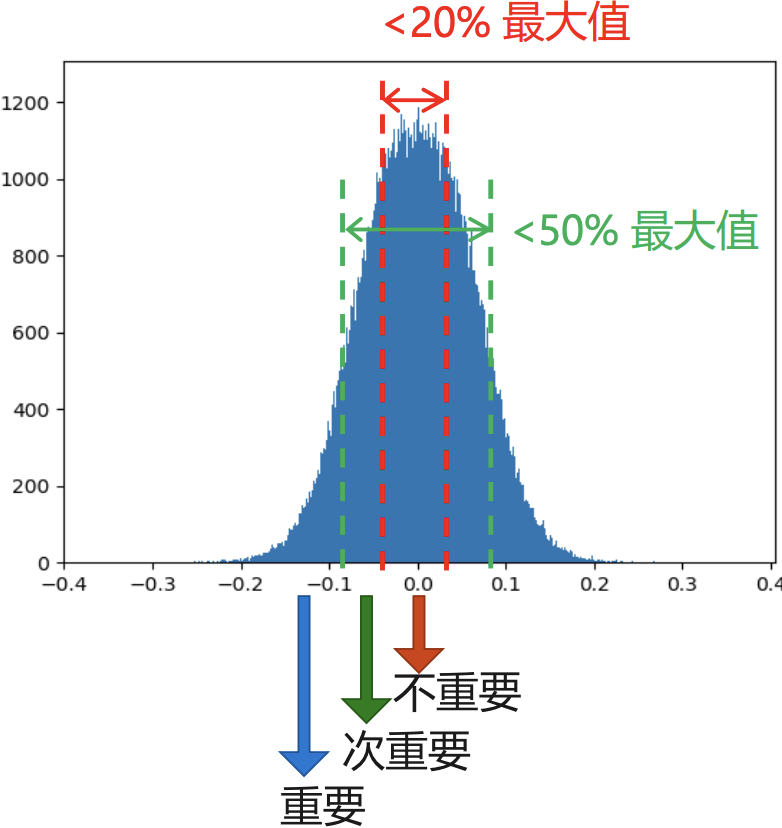
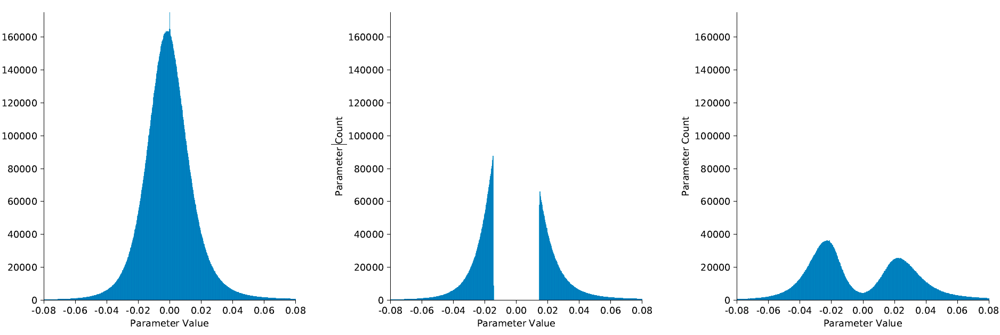

## 一，前言

学术界的 SOTA 模型在落地部署到工业界应用到过程中，通常是要面临着低延迟（`Latency`）、高吞吐（`Throughpout`）、高效率（`Efficiency`）挑战的。而模型压缩算法可以将一个庞大而复杂的预训练模型转化为一个精简的小模型，从而减少对硬件的存储、带宽和计算需求，以达到加速模型推理和落地的目的。

近年来主流的模型压缩方法包括：**数值量化（Data Quantization，也叫模型量化）**，**模型稀疏化（Model sparsification，也叫模型剪枝 Model Pruning）**，**知识蒸馏（Knowledge Distillation）**， **轻量化网络设计（Lightweight Network Design）和 张量分解（Tensor Decomposition）**。

其中模型剪枝是应用非常广的一种模型压缩方法，其可以直接减少模型中的参数量。本文会对模型剪枝的定义、发展历程、分类以及算法原理进行详细的介绍。

### 1.1，模型剪枝定义

模型剪枝（`Pruning`）也叫模型稀疏化，不同于模型量化对每一个权重参数进行压缩，稀疏化方法是尝试直接“删除”部分权重参数。 模型剪枝的原理是通过剔除模型中 “不重要” 的权重，使得模型减少参数量和计算量，同时尽量保证模型的精度不受影响。

## 二，深度神经网络的稀疏性

生物研究发现人脑是高度稀疏的。2016 年早期经典的剪枝论文 [1 ][1]曾提到，生理学上发现对于哺乳动物，婴儿期产生许多的突触连接，在后续的成长过程中，不怎么用的那些突出会退化消失。而深度神经网络是模仿人类大脑的结构，所以说其也是存在稀疏的，这也是作者提出的模型剪枝方法的生理学上依据。因此，我们可以认为深度神经网络是存在稀疏性的。

根据深度学习模型中可以被稀疏化的对象，深度神经网络中的稀疏性主要包括**权重稀疏**，**激活稀疏**和**梯度稀疏**。

### 2.1，权重稀疏

在大多数神经网络中，通过对网络层（卷积层或者全连接层）对权重数值进行直方图统计，可以发现，权重（训练前/训练后）的数值分布很像正太分布（或者是多正太分布的混合），且越接近于 0，权重越多，这句是**权重稀疏**现象。

论文  [1 ][1] 认为，权重数值的绝对值大小可以看做重要性的一种度量，权重数值越大对模型输出贡献也越大，反正则不重要，删去后模型精度的影响应该也比较小。



当然，影响较小不等于没有影响，且**不同类型、不同顺序的网络层，在权重剪枝后影响也各不相同**。论文  [1 ][1] 在 AlexNet 的 CONV 层和 FC 层的剪枝敏感性实验，结果如下图所示。


从图中实验结果可以看出，卷积层的剪枝敏感性大于全连接层，且第一个卷积层对剪枝最为敏感。论文作者推测这是因为全连接层本身参数冗余性更大，第一个卷积层的输入只有 3 个通道所以比起他卷积层冗余性更少。

即使是移除绝对值接近于 0 的权重也会带来推理精度的损失，因此为了恢复模型精度，通常在剪枝之后需要再训练模型。典型的模型剪枝三段式工作 `pipeline` 流程和剪枝前后网络连接变化如下图所示。


> 剪枝算法常用的迭代计算流程:训练、剪枝、微调。

剪枝`Three-Step Training Pipeline` 中三个阶段权重数值分布如下图所示。微调之后的模型权重分布将部分地恢复正太分布的特性。



> 深度网络中存在权重稀疏性:（a）剪枝前的权重分布；（b）剪除0值附近权值后的权重分布；（c）网络微调后的权重分布

### 2.2，激活稀疏

早期的神经网络模型-早期的神经网络模型——多层感知机（MLP）中，多采用Sigmoid函数作为激活单元。但是其复杂的计算公式会导致模型训练过慢，且随着网络层数的加深，Sigmoid 函数引起的梯度消失和梯度爆炸问题严重影响了反向传播算法的实用性。为解决上述问题，Hinton 等人于 2010 年在论文中 [2 ][2] 提出了 `ReLU` 激活函数，并在 `AlexNet`模型 [3][3] 中第一次得到了实践。

后续伴随着 `BN` 层算子的提出，“2D卷积-BN层-ReLU激活函数”三个算子串联而成的基本单元就构成了后来 CNN 模型的基础组件，如下述 `Pytorch` 代码片段所示：

> 早期是 “2D卷积-ReLU激活函数-池化” 这样串接的组件。

```python
# cbr 组件示例代码
def convbn_relu(in_planes, out_planes, kernel_size, stride, pad, dilation):
    return nn.Sequential(
        nn.Conv2d(in_planes, out_planes, 
                  kernel_size=kernel_size, stride=stride, 
                  padding=dilation if dilation > 1 else pad, 
                  dilation=dilation, bias=False),
        nn.BatchNorm2d(out_planes),
        nn.ReLU(inplace=True)
        )
```

ReLU 激活函数的定义为：
$$
ReLU(x) = max(0, x)
$$
该函数使得负半轴的输入都产生 0 值的输出，这可以认为激活函数给网络带了另一种类型的稀疏性。另外 `max_pooling` 池化操作也会产生类似稀疏的效果。即无论网络接收到什么输入，大型网络中很大一部分神经元的输出大多为零。激活和池化稀疏效果如下图所示。


受以上现象启发，论文[4][4] 认为这些**零激活神经元**是冗余的，可以在不影响网络整体精度的情况下将其移除。并提出了一种**神经元剪枝**算法。首先，定义了 `APoZ` （Average Percentage of Zeros）指标来衡量经过 ReLU  映射后神经元零激活的百分比。

假设 $O_c^{(i)}$表示网络第 $i$ 层中第 $c$ 个通道（特征图）的结果，那么第 $i$ 层中第 $c$ 个的神经元的 APoZ 定义如下:
$$
APoZ^{(i)}_c = APoZ(O_c^{(i)}) = \frac{\sum_k^N \sum_j^M f(O^{(i)}_{c,j}(k=0))}{N \times M}
$$
这里，$f\left( \cdot \right)$ 对真的表达式输出 1，反之输出 0，$N$ 与 $M$ 分别表示用于验证的图像样本个数、及每个特征图的维度，由于每个特征图均来自一个滤波器（神经元）的卷积及激活映射结果，因此上式衡量了该神经元对一组特定图像的计算结果中 0 值输出的平均比例。

下图给出了在 VGG-16 网络的 CONV5-3 层中，利用 50,000 张 ImageNet 图像样本计算得到的所有 512个 神经元的 APoZ 指标分布图。可以看出大多数神经元的该项指标都分布在 93%附近。实际上，该网络中共有 631 个神经元的 APoZ 值超过90%。激活函数的引入反映出VGG 网络存在着大量的稀疏与冗余性。


> ReLU激活函数输出结果中存在高度的稀疏性。

### 1.3，梯度稀疏


## 参考资料

- [1]: https://arxiv.org/pdf/1506.02626.pdf

- [2]: https://www.cs.toronto.edu/~hinton/absps/reluICML.pdf

- [3]: https://proceedings.neurips.cc/paper/2012/file/c399862d3b9d6b76c8436e924a68c45b-Paper.pdf

- [ 4 ]: https://arxiv.org/pdf/1607.03250.pdf (Network Trimming: A Data-Driven Neuron Pruning Approach towards Efficient Deep Architectures)

- [5]:https://arxiv.org/pdf/1607.03250.pdf

- 