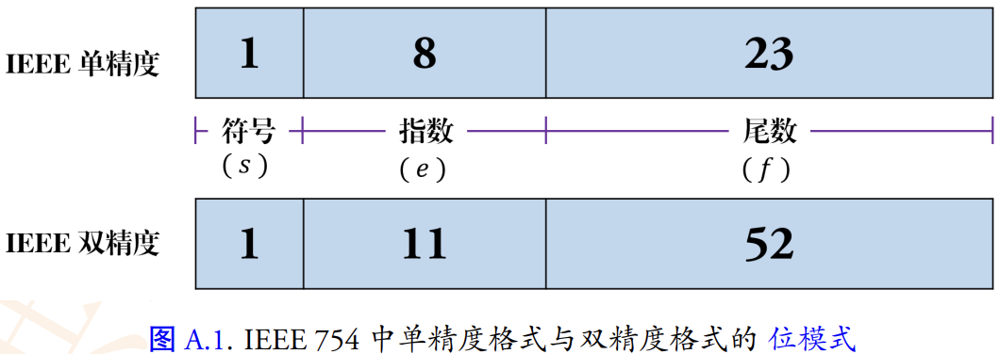

## 前言

### 浮点数（floating-point）详解

浮点数是一种对于数学中实数的近似值数值表现法，其由符号、尾数、基和指数组成，如 $−0.3141592610 \times 10^2$， $0.101001_{2} \times 2^{3}$。

> 在数学中，实数（real number）是有理数和无理数的总称，直观理解就是**小数**。

在 `IEEE 754` 标准中, 浮点数是用二进制表示的, 形式如下：
$$
V = (-1)^s \times f \times 2^{e}
$$
其由三部分组成:

- 符号，sign，其值用 $s$ 表示。
- 指数，exponent，其值用 $e$ 表示，对于单精度浮点数，指数占 `8` 位
- 尾数，fraction，其值用 $f$ 表示。

IEEE 754 标准中的单精度和双精度格式如下图所示：



单精度浮点数值的分类：

1，**规格化的**（一般情况）：

指数位既不全为 0（数值 0），也不全位 1（单精度数值 255，双精度数值 2047）。这种情况下,指数为被定义以偏置形式表示的有符号整数，即指数位数值是 $E = e - Bias$。计算过程省略，但是由此产生的指数的取值范围，对于单精度是 $-126～+127$，而对于双精度是 $-1022~+1023$。

对于单精度的规格化数，其数值范围为 $[1\times 2^{-126}, (2-\varepsilon) \times 2^{127}], \varepsilon = 0$，经过换算十进制数范围为 $[1.17 \times 10^{-38}, 3.4 \times 10^{38}]$。

```bash
2^{-126} = 1.17*10^{-38}
2 * 2^{127} = 3.4*10^{38}
```

2，非规格化的

CSAPP 中文书上翻译为阶码域为全 0 时，所表示的数时非规格化形式，即指数为全为 0（数值 0）。

3，**特殊值**。

和非规格化相反，阶码域为全 1 。

## 参考资料

1. [后训练量化——Data free quantization](https://mp.weixin.qq.com/s?__biz=Mzg4ODA3MDkyMA==&mid=2247484062&idx=1&sn=e7f544a95dca6e7039437a396ad2a736&chksm=cf81f4f9f8f67def2f94cdec41a1520ad42590aeb39a0893eccfe0ed889537c892f61ad5be70&token=1900020351&lang=zh_CN#rd)
2. [神经网络量化--从早期的量化算法谈起](https://mp.weixin.qq.com/s?__biz=Mzg4ODA3MDkyMA==&mid=2247483895&idx=1&sn=4dd9f306b6afc6069d066256438fc6bc&chksm=cf81f790f8f67e8684ef4d65608a1aa201a0d021a0b36d6f86ac925edd07b3bfefba0258304e&token=1561419299&lang=zh_CN#rd)
3. [SystemforAI-10-Efficiency via Compression and Sparsity](https://github.com/microsoft/AI-System/blob/8fb334fff3ec150a310ebd4fed16594c11e55f29/docs/SystemforAI-10-Efficiency%20via%20Compression%20and%20Sparsity.pdf)
4. [NNI 文档](https://nni.readthedocs.io/zh/stable/)
5. [附录 A IEEE 浮点运算标准](https://math.ecnu.edu.cn/~jypan/Teaching/MatrixComp/refs/A1_IEEE_float.pdf)