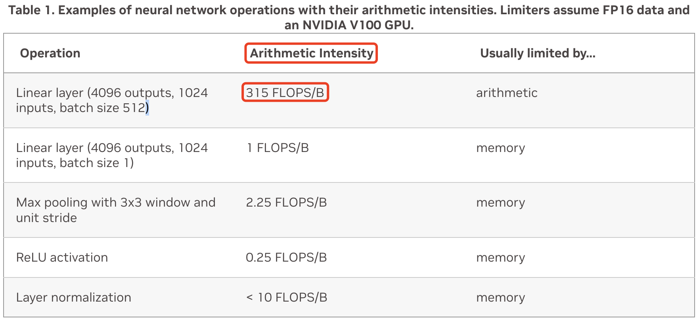

## 一，概览

本文主要介绍了 GPU 结构、操作的执行方式以及深度学习操作的常见限制，目的是为了更好的理解 GPU 的基本运行原理以及神经网络或特定网络层如何高效利用给定 `GPU`。

本文主要内容可分为以下部分：

1. **GPU 架构基础**：了解 GPU 基本结构有助于神经网络在给定 GPU 上的高效运行。
2. **GPU 执行模型**：理解神经网络层/算子是如何被分割和并行执行的。
3. **理解性能**：如何通过算术强度（arithmetic intensity）来评估 GPU 性能限制。
4. **DNN 算子类别**：深度学习算子的宽松分类及其通常适用的性能限制。

## 二，GPU 架构基础

GPU 是一种**高度并行的处理器架构**，由处理元件和内存层次结构组成。在较高层面上，NVIDIA® GPU 由多个流式多处理器（Streaming Multiprocessors，SMs）、片上 L2 缓存和高带宽 DRAM 组成。`SMs` 执行算术和其他指令，数据和代码通过 L2 缓存从 DRAM 中访问。举个例子，NVIDIA A100 GPU 包含 108 个 SMs，一个 40MB 的L2缓存，以及 80 GB HBM2 内存并提供高达 2039 GB/s 的带宽。

图1. GPU架构的简化视图

每个 `SM` 都有自己的指令调度器和各种指令执行管道。乘加运算是现代神经网络中最常见的运算，是全连接层和卷积层的构建块，这两个层都都可以看作是一组向量点乘的集合。 

下表显示了 NVIDIA 最新 GPU 架构上，不同数据类型的单个 SM 每个时钟周期的乘加操作次数。每个乘加操作都包含两个运算，因此将表中的吞吐量乘以 2，即可获得每个时钟的 FLOP 计数。要获得 GPU 的 `FLOPS` 速率，需要将其乘以 SM 数量和 SM 时钟速率。 例如，具有 108 个 SM 和 1.41 GHz 时钟频率的 A100 GPU 的峰值密集吞吐量为 156 TF32 TFLOPS 和 312 FP16 TFLOPS（应用程序实现的吞吐量取决于本文档中讨论的许多因素）。

图 2. SM 每个时钟的乘加运算

如图2所示，`FP16` 操作可以在 Tensor Cores 或 NVIDIA CUDA® 核心中执行。此外，NVIDIA Turing™ 架构可以在 Tensor Cores 或 CUDA 核心中执行 `INT8` 操作。`Tensor Cores` 是在NVIDIA Volta™ GPU 架构中引入的，用于加速机器学习和科学应用中的矩阵乘法和累加操作。这些指令对小矩阵块（例如 4x4 块）进行操作。值得注意的是，Tensor Cores 可以以比输入更高的精度计算和累加乘积。例如，在使用 FP16 输入进行训练时，Tensor Cores 可以在不丢失精度的情况下计算乘积，并以FP32 累加。**当数学运算无法用矩阵块表示时，它们将在其他 CUDA 核心中执行**。例如，两个半精度张量的逐元素加法将由 CUDA 核心执行，而不是 Tensor Cores。

## 三，GPU 执行模型

为了利用并行资源，GPU 会同时执行许多线程。

有两个概念对于理解线程数与 GPU 性能的关系至关重要：

1. GPU 使用两级线程层次结构执行函数。 给定函数的线程被分组为大小相等的线程块，并启动一组线程块来执行该函数。
2. GPU 通过切换到其他线程的执行来隐藏相关指令延迟。 因此，有效利用 GPU 所需的线程数的重要性远远高于核心数或指令流水线数。

2 级线程层次结构是因为 GPU 内部有很多 SM，**每个 SM 又具有用于执行多个线程的流水线**，并通过共享内存和同步来实现线程间的通信。GPU 运行时，线程块（thread block）是放在 SM 上执行，这使得线程块中的所有线程都能够高效地通信和同步。因为使用单个线程块启动函数将只有一个 SM 被分配工作，因此要充分利用具有多个 SM 的 GPU，就需要启动多个线程块。又因为一个 SM 可以同时执行多个线程块，通常希望线程块的数量是 SM 数量的几倍。这样做的原因是为了最大限度地减少“尾部”效应，即在函数执行结束时，只有少数活动线程块保留，从而导致该时间段内 GPU 利用率不足，如图 3 所示。

图3. 当一次占用 1 个块/SM 的 12 个线程块启动执行时，8-SM GPU 的利用率。 此处，块分 2 波执行，第一波利用 100% 的 GPU，而第二波仅利用 50%。

我们使用术语 “wave” 来指代一组并发运行的线程块。最有效的做法是启动可以在多个线程块中执行的函数，这样在“尾部”波浪中花费的时间较少，从而最小化“尾部”效应，并减少需要处理它的必要性。对于高端GPU，通常只有少于300个线程块的启动需要检查“尾部”效应。

## 四，理解性能

一个函数在给定处理器上的性能受到以下三个因素之一的限制：**内存带宽** memory bandwidth、**数学带宽** math bandwidth 和**延迟** Latency。
> 这里的数学带宽其实就是 GPU 算力。

考虑一个简化的模型，其中一个函数从内存中读取输入，执行数学运算，然后将输出写入内存。

假设 $\text{T\_mem}$ 表示访问内存所花费的时间，$\text{T\_math}$ 表示执行数学运算所花费的时间。如果进一步假设不同线程的内存和数学部分可以重叠，那么函数的总时间为 $\text{(T\_mem, T\_math)}$ 。其中较长的时间决定了性能的限制：如果数学时间较长，则称函数受数学限制；如果内存时间较长，则称函数受内存限制；即 所谓的 memory bound vs math/compute bound。

内存或数学运算花费多少时间取决于算法及其实现，以及处理器的带宽。 内存时间等于内存中访问的字节数除以处理器的内存带宽。 数学时间等于运算次数除以处理器的数学带宽。因此，在给定的处理器上，如果一个特定的算法满足以下条件，那么它是受数学限制的：

$T\_math > T\_mem$ 可表示为 $\#ops / BW\_math > \# bytes / BW\_mem$。

通过简单的代数，不等式可以重新排列为:

$\text{\#ops / \#bytes} > \text{BW\_math / BW\_mem}$。

左边是**算法实现操作数与访问字节数的比值**，被称为算法的**算术强度**（arithmetic intensity）。右边是**处理器的数学带宽与内存带宽的比值**，有时被称为操作：**字节比率**（ops:byte ratio）。因此，对于给定的处理器，如果算法的算术强度高于处理器的操作：字节比率，那么该算法在该处理器上是受数学限制的。相反，如果算法的算术强度低于处理器的操作：字节比率，则该算法受内存限制。

具体示例在下表 1 中。对于这些例子，我们将比较算法的算术强度与 NVIDIA Volta V100 GPU 的操作：字节比率。V100 GPU 的峰值数学速率为 125 FP16 Tensor TFLOPS，**片外内存带宽**约为 900 GB/s，芯片上 L2 缓存的带宽为3.1 TB/s，因此其操作：字节比率在 40 到 139 之间，取决于操作数据的来源（片内或片外存储器）。

如表格所示，**许多常见操作的算术强度较低**，有时每读取或写入内存的两个字节元素只执行一次操作。需要注意的是，这种分析是一种简化，因为我们只计算了算法中使用的算法操作。在实践中，函数还包含了对算法中未明确表示的操作的指令，如**内存访问指令、地址计算指令、控制流指令**等等。

算术强度和操作：字节比率的分析假设工作负载足够大，能够饱和给定处理器的数学和内存流水线。然而，如果工作负载不足够大，或者没有足够的并行性，处理器将被低效利用，性能将受到延迟的限制。例如，考虑只启动一个线程，它将访问16字节并执行16000次数学运算。虽然算术强度为1000 FLOPS/B，根据V100 GPU的情况，执行应该受数学限制，但是只创建一个线程严重低效地利用了GPU，几乎使其所有的数学流水线和执行资源处于空闲状态。此外，算术强度的计算假设输入和输出仅从内存中访问一次。算法实现中多次读取输入元素并不少见，这将有效降低算术强度。因此，算术强度是一个一阶近似值；如果需要更准确的分析，应使用性能分析器的信息。

## 五，DNN 操作类别 

虽然现代神经网络是由多个层构建的，但根据计算的性质，它们的操作分为三个主要类别。

### 5.1，逐元素操作

### 5.2，减少操作

减少操作（Reduction operations）是对输入张量值的范围进行计算并生成结果值的操作。

### 5.3，点积操作（Dot-Product Operations）

该类别的操作可以表示为两个张量元素的点积，通常是权重（学习参数）张量和激活张量的点积计算。

