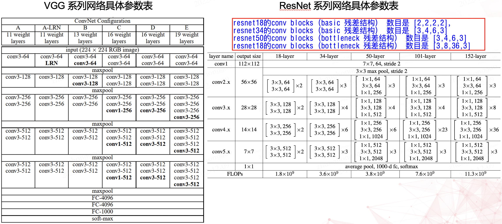
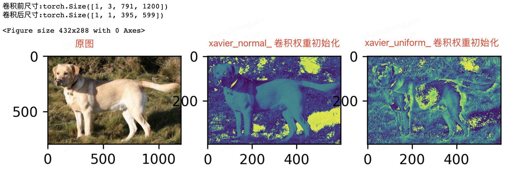

## 前言

**所谓超参数，即不是通过学习算法本身学习出来的，需要作者手动调整（可优化参数）的参数**(理论上我们也可以设计一个嵌套的学习过程，一个学习算法为另一个学习算法学出最优超参数)，卷积神经网络中常见的超参数有: 优化器学习率、训练 `Epochs` 数、批次大小 `batch_size` 、输入图像尺寸大小。

一般而言，我们将训练数据分成两个不相交的子集，其中一个用于学习参数，另一个作为验证集，用于估计训练中或训练后的泛化误差，用来更新超参数。

- 用于学习参数的数据子集通常仍被称为训练集（不要和整个训练过程用到的更大的数据集搞混）。
- 用于挑选超参数的数据子集被称为验证集(`validation set`)。

通常，`80%` 的训练数据用于训练，`20%` 用于验证。因为验证集是用来 “训练” 超参数的，所以**验证集的误差通常会比训练集误差小**，验证集会低估泛化误差。完成所有超参数优化后，**需要使用测试集估计泛化误差**。

## 网络层参数

在设计网络架构的时候，我们通常需要事先指定一些网络架构参数，比如:
- 卷积层(`convlution`)参数: 卷积层通道数、卷积核大小、卷积步长；
- 池化层(`pooling`)参数: 池化核大小、步长等。
- **网络深度**（这里特指卷积神经网络 cnn），即 `layer` 的层数；网络的深度一般决定了网络的表达（抽象）能力，网络越深学习能力越强。
- **网络宽度**，即卷积层通道(`channel`)的数量，也是**滤波器**（3 维）的数量；网络宽度越宽，代表这一层网络能学习到更加丰富的特征。

这些参数一般在设计网络架构时就已经确定下来了，参数的取值一般可以参考经典 `paper` 和一些模型训练的经验总结，比如有以下经验:

1，$3\times 3$ 卷积层是 `cnn` 的主流组件，比如提取图像特征的 `backbone` 网络中，其卷积层的卷积核大小大部分都是 $3\times 3$。比如 vgg 和 resnet 系列网络具体参数表如下所示。



2. 在 `cnn` 模型中，卷积层（`conv`）一般后接 `bn`、`relu` 层，组成 `cbr` 套件。模型训练好后，模型推理时的卷积层和其后的 `BN` 层可以等价转换为一个带 `bias` 的卷积层（也就是通常所谓的“吸BN”），其原理参考[深度学习推理时融合BN，轻松获得约5%的提速](https://mp.weixin.qq.com/s/P94ACKuoA0YapBKlrgZl3A)。

```python
# cbr 组件示例代码
def convbn_relu(in_planes, out_planes, kernel_size, stride, pad, dilation):

    return nn.Sequential(nn.Conv2d(in_planes, out_planes, kernel_size=kernel_size, stride=stride,
                                   padding=dilation if dilation > 1 else pad, dilation=dilation, bias=False),
                         nn.BatchNorm2d(out_planes),
                         nn.ReLU(inplace=True))
```
3，使用 `imagenet` 预训练模型权重 `finetune` 模型。

4，尝试不同的卷积核权重初始化方式。目前常用的权重初始化方法有 `Xavier` 和 `kaiming` 系列，pytorch 在 `torch.nn.init` 中提供了常用的初始化方法函数，默认是使用 `kaiming ` 均匀分布函数: `nn.init.kaiming_uniform_()`。


下面是一个使用 `kaiming_normal_`（kaiming正态分布）设置卷积层权重初始化的示例代码。

```python
import torch
import torch.nn as nn

# 定义一个卷积层
conv = nn.Conv2d(in_channels=3, out_channels=16, kernel_size=3, stride=1, padding=1)

# 使用He初始化方式设置卷积层的权重
nn.init.kaiming_normal_(conv.weight, mode="fan_out", nonlinearity="relu")
```

使用不同的卷积层权重初始化方式，会有不同的输出效果。分别使用 `xavier_normal_` 和 `xavier_normal_` 初始化权重，并使一个输入图片经过一层卷积层，其输出效果是不同的，对比图如下所示:




## 学习率参数

模型架构和数据集构建好后，就可以训练模型了，模型训练的一个关键超参数是是模型学习率(learning rate)，一个理想的学习率会促进模型收敛，而不理想的学习率甚至会直接导致模型直接目标函数损失值 “爆炸” 无法完成训练。学习率的设置有两个原则可以遵守:

1. 模型训练开始时的初始学习率不宜过大，以 `0.01` 和 `0.001` 为宜；
2. 模型训练过程中，学习率应随轮数（`Epochs`）增加而减缓。


## 参考资料

- 《深度学习》第五章-机器学习基础
- [知乎问答-深度学习调参有哪些技巧？](https://www.zhihu.com/question/25097993)
- [深度学习500问-第十四章超 参数调整](https://github.com/scutan90/DeepLearning-500-questions/blob/master/ch14_%E8%B6%85%E5%8F%82%E6%95%B0%E8%B0%83%E6%95%B4/%E7%AC%AC%E5%8D%81%E5%9B%9B%E7%AB%A0_%E8%B6%85%E5%8F%82%E6%95%B0%E8%B0%83%E6%95%B4.md)
- [pytorch 学习笔记-3.2 卷积层](https://pytorch.zhangxiann.com/3-mo-xing-gou-jian/3.2-juan-ji-ceng#juan-ji-wang-luo-shi-li)