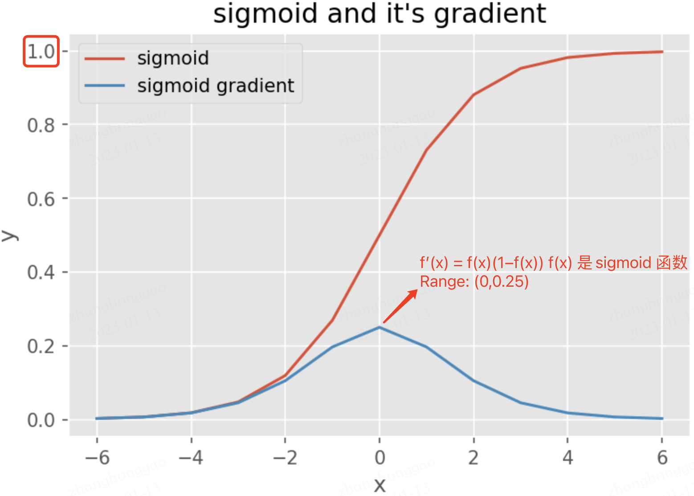
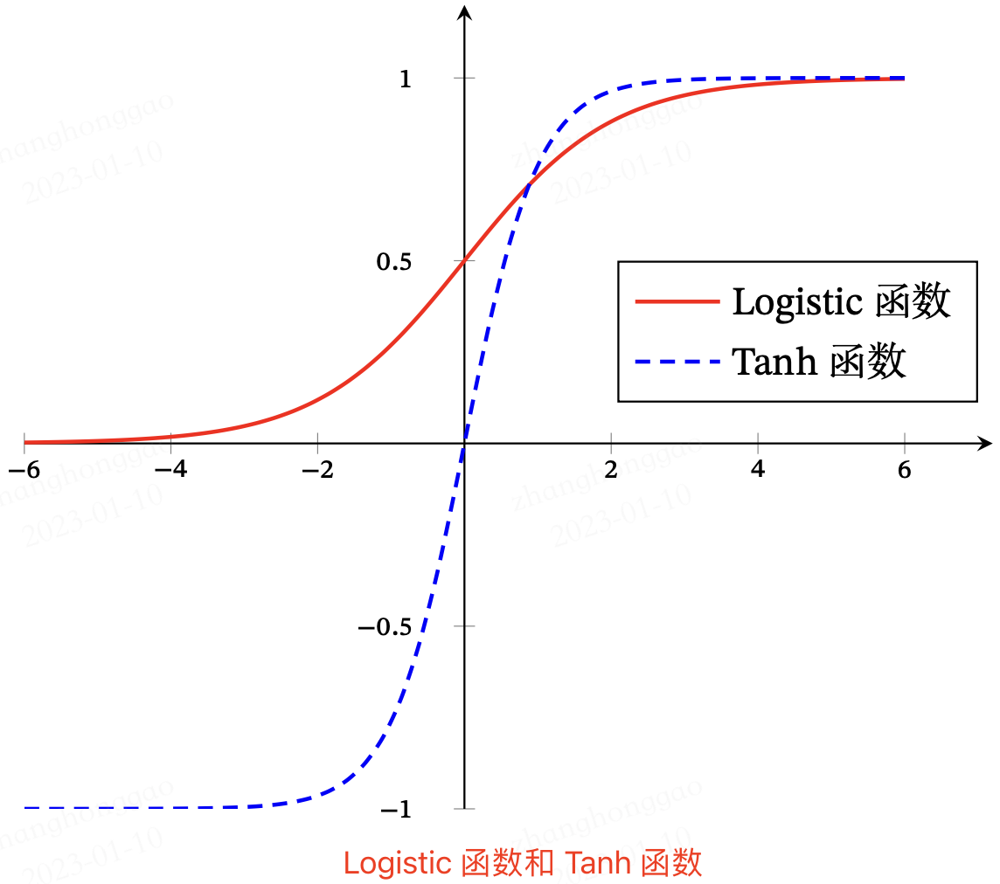
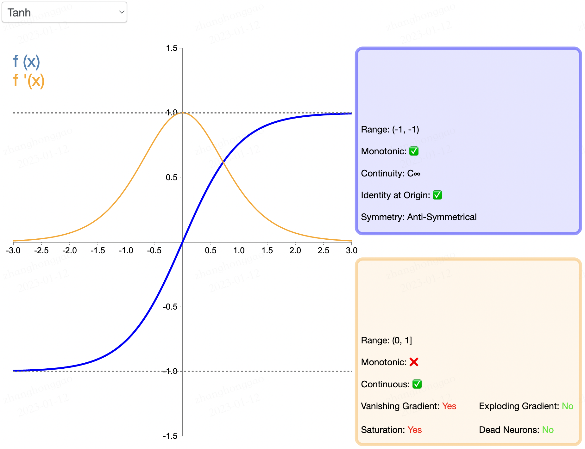
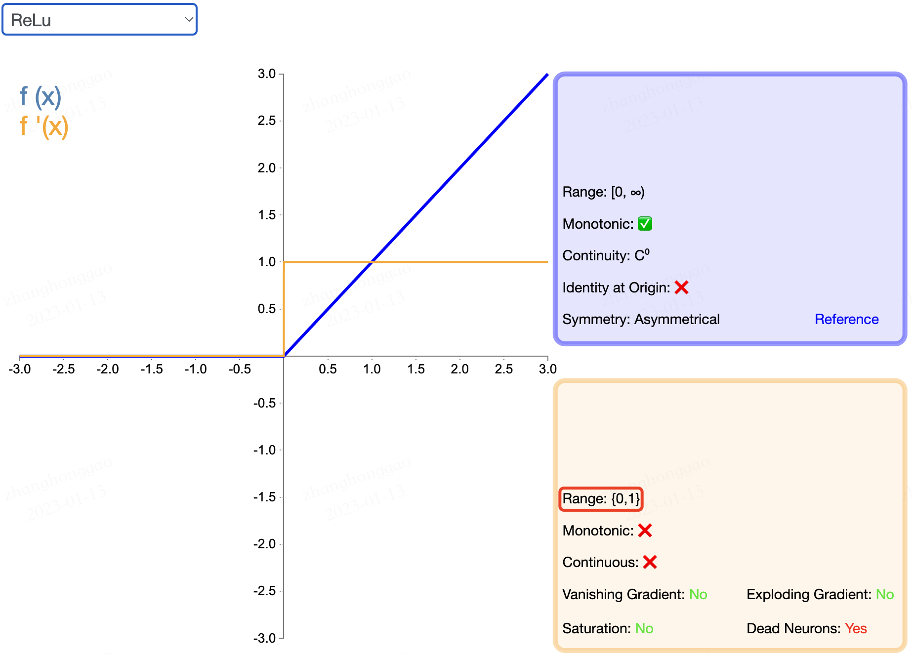
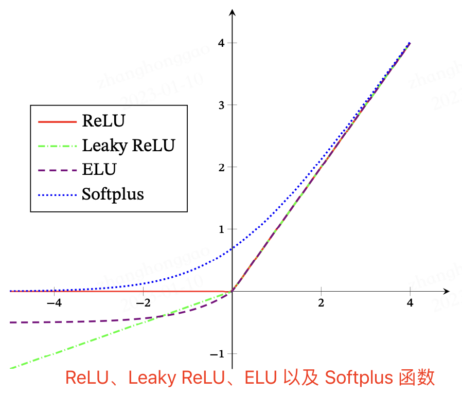
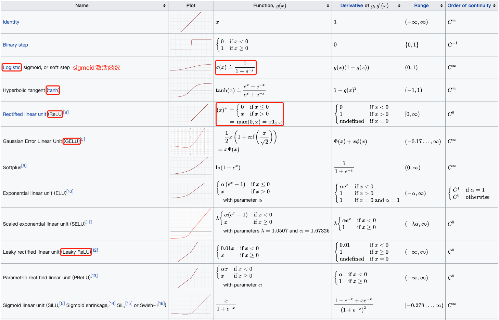

- [激活函数概述](#激活函数概述)
  - [前言](#前言)
  - [激活函数定义](#激活函数定义)
  - [激活函数性质](#激活函数性质)
- [Sigmoid 型函数](#sigmoid-型函数)
  - [Sigmoid 函数](#sigmoid-函数)
  - [Tanh 函数](#tanh-函数)
- [ReLU 函数及其变体](#relu-函数及其变体)
  - [ReLU 函数](#relu-函数)
  - [Leaky ReLU/PReLU/ELU/Softplus 函数](#leaky-relupreluelusoftplus-函数)
- [Swish 函数](#swish-函数)
- [激活函数总结](#激活函数总结)
- [参考资料](#参考资料)

> 本文分析了激活函数对于神经网络的必要性，同时讲解了几种常见的激活函数的原理，并给出相关公式、代码和示例图。

## 激活函数概述

### 前言

人工神经元(Artificial Neuron)，简称神经元(Neuron)，是构成神经网络的基本单元，其主要是模拟生物神经元的结构和特性，接收一组输入信号并产生输出。生物神经元与人工神经元的对比图如下所示。


从机器学习的角度来看，神经网络其实就是一个**非线性模型**，其基本组成单元为具有非线性激活函数的神经元，通过大量神经元之间的连接，使得多层神经网络成为一种高度非线性的模型。**神经元之间的连接权重就是需要学习的参数**，其可以在机器学习的框架下通过**梯度下降方法**来进行学习。
> 深度学习一般指的是深度神经网络模型，泛指网络层数在三层或者三层以上的神经网络结构。

### 激活函数定义

激活函数（也称“非线性映射函数”），是深度卷积神经网络模型中必不可少的网络层。

假设一个神经元接收 $D$ 个输入 $x_1, x_2,⋯, x_D$，令向量 $x = [x_1;x_2;⋯;x_𝐷]$ 来表示这组输入，并用净输入(Net Input) $z \in \mathbb{R}$ 表示一个神经元所获得的输入信号 $x$ 的加权和:

$$
z = \sum_{d=1}^{D} w_{d}x_{d} + b = w^\top x + b
$$

其中 $w = [w_1;w_2;⋯;w_𝐷]\in \mathbb{R}^D$ 是 $D$ 维的权重矩阵，$b \in \mathbb{R}$ 是偏置向量。

以上公式其实就是**带有偏置项的线性变换**（类似于放射变换），本质上还是属于线形模型。为了转换成非线性模型，我们在净输入 $z$ 后添加一个**非线性函数** $f$（即激活函数）。

$$a = f(z)$$

由此，典型的神经元结构如下所示:


### 激活函数性质

为了增强网络的表示能力和学习能力，激活函数需要具备以下几点性质:
1. **连续并可导(允许少数点上不可导)的非线性函数**。可导的激活函数 可以直接利用数值优化的方法来学习网络参数。
2. 激活函数及其导函数要**尽可能的简单**，有利于提高网络计算效率。
3. 激活函数的导函数的**值域要在一个合适的区间内**，不能太大也不能太小，否则会影响训练的效率和稳定性.

## Sigmoid 型函数

Sigmoid 型函数是指一类 S 型曲线函数，为两端饱和函数。常用的 Sigmoid 型函数有 Logistic 函数和 Tanh 函数。
> 相关数学知识: 对于函数 $f(x)$，若 $x \to −\infty$ 时，其导数 ${f}'\to 0$，则称其为左饱和。若 $x \to +\infty$ 时，其导数 ${f}'\to 0$，则称其为右饱和。当同时满足左、右饱和时，就称为两端饱和。

### Sigmoid 函数

对于一个定义域在 $\mathbb{R}$ 中的输入，`sigmoid` 函数将输入变换为区间 `(0, 1)` 上的输出（sigmoid 函数常记作 $\sigma(x)$）:

$$
\sigma(x) = \frac{1}{1 + exp(-x)}
$$

sigmoid 函数的导数公式如下所示:

$$
\frac{\mathrm{d} }{\mathrm{d} x}\text{sigmoid}(x) = \frac{exp(-x)}{(1+exp(-x))^2} = \text{sigmoid}(x)(1 - \text{sigmoid}(x))
$$

sigmoid 函数及其导数曲线如下所示:



注意，当输入为 0 时，sigmoid 函数的导数达到最大值 0.25; 而输入在任一方向上越远离 0 点时，导数越接近 `0`。

目前 `sigmoid` 函数在隐藏层中已经较少使用，原因是 `sigmoid` 的软饱和性，使得深度神经网络在过去的二三十年里一直难以有效的训练，如今其被更简单、更容易训练的 `ReLU` 等激活函数所替代。

当我们想要输出二分类或多分类、多标签问题的概率时，`sigmoid` **可用作模型最后一层的激活函数**。下表总结了常见问题类型的最后一层激活和损失函数。

|问题类型|最后一层激活|损失函数|
|-------|----------|-------|
|二分类问题（binary）|`sigmoid`|`sigmoid + nn.BCELoss`(): 模型最后一层需要经过 ` torch.sigmoid` 函数|
|多分类、单标签问题（Multiclass）|`softmax`|`nn.CrossEntropyLoss()`: 无需手动做 `softmax`|
|多分类、多标签问题（Multilabel）|`sigmoid`|`sigmoid + nn.BCELoss()`: 模型最后一层需要经过 `sigmoid` 函数|

> `nn.BCEWithLogitsLoss()` 函数等效于 `sigmoid + nn.BCELoss`。

### Tanh 函数

`Tanh`（双曲正切）函数也是一种 Sigmoid 型函数，可以看作放大并平移的 `Sigmoid` 函数，公式如下所示：

$$
\text{tanh}(x) = 2\sigma(2x) - 1 = \frac{2}{1 + e^{-2x}} - 1
$$

首先相同的是，这两个函数在输入很大或是很小的时候，输出都几乎平滑，梯度很小，不利于权重更新；不同的是输出区间，tanh 的输出区间是在 (-1,1) 之间，而且整个函数是以 0 为中心的，这个特点比 sigmod 的好。

Sigmoid 函数和 Tanh 函数曲线如下图所示:


另外一种  Logistic 函数和 Tanh 函数的形状对比图:


> 图片来源: 《神经网络与深度学习》图4.2。

`Tanh` 函数及其导数曲线如下所示:



结合前面的 `Sigmoid` 函数及其导数曲线进行对比分析，可以看出 `Sigmoid` 和 `Tanh` 函数在输入很大或是很小的时候，**输出都几乎平滑且梯度很小趋近于 0**，不利于权重更新；不同的是 `Tanh` 函数的输出区间是在 `(-1,1)` 之间，而且整个函数是以 0 为中心的，这个特点比 `Sigmoid` 的好。

**两种激活函数实现和可视化代码**如下所示:

```python
# example plot for the sigmoid activation function
from math import exp
from matplotlib import pyplot
import matplotlib.pyplot as plt

# sigmoid activation function
def sigmoid(x):
    """1.0 / (1.0 + exp(-x))
    """
    return 1.0 / (1.0 + exp(-x))

def tanh(x):
    """2 * sigmoid(2*x) - 1
    (e^x – e^-x) / (e^x + e^-x)
    """
    # return (exp(x) - exp(-x)) / (exp(x) + exp(-x))
    return 2 * sigmoid(2*x) - 1

def relu(x):
    return max(0, x)

def gradient_relu(x):
    if x < 0:
        return 0
    else:
        return 1

def gradient_sigmoid(x):
    """sigmoid(x)(1−sigmoid(x))
    """
    a = sigmoid(x)
    b = 1 - a
    return a*b

# 1, define input data
inputs = [x for x in range(-10, 11)]

# 2, calculate outputs
outputs = [sigmoid(x) for x in inputs]
outputs2 = [tanh(x) for x in inputs]

# 3, plot sigmoid and tanh function curve
plt.figure(dpi=100) # dpi 设置
plt.style.use('ggplot') # 主题设置

plt.plot(inputs, outputs, label='sigmoid')
plt.plot(inputs, outputs2, label='tanh')

plt.xlabel("x") # 设置 x 轴标签
plt.ylabel("y")
plt.title('sigmoid and tanh') # 折线图标题
plt.legend()
plt.show()
```

Logistic 函数和 Tanh 函数都是 Sigmoid 型函数，具有饱和性，但是**计算开销较大**。因为这两个函数都是在中间(0 附近)近似线性，两端饱和。因此，这两个函数可以通过分段函数来近似。

## ReLU 函数及其变体
### ReLU 函数

`ReLU`(Rectified Linear Unit，修正线性单元)，是目前深度神经网络中**最经常使用的激活函数**，它保留了类似 step 那样的生物学神经元机制: 输入超过阈值才会激发。公式如下所示:

$$ReLU(x) = max\{0,x\} = \left\{\begin{matrix}
x & x\geqslant 0 \\ 
0 & x< 0
\end{matrix}\right.$$

以上公式通俗理解就是，`ReLU` 函数仅保留正元素并丢弃所有负元素。注意: 虽然在 `0` 点不能求导，但是并不影响其在以梯度为主的反向传播算法中发挥有效作用。

1，**优点**: 

- `ReLU` 激活函数**计算简单**；
- 具有**很好的稀疏性**，大约 50% 的神经元会处于激活状态。
- 函数在 $x > 0$ 时导数为 1 的性质（**左饱和函数**），在一定程度上缓解了神经网络的梯度消失问题，加速梯度下降的收敛速度。
> 相关生物知识: 人脑中在同一时刻大概只有 1% ∼ 4% 的神经元处于活跃 状态。

2，**缺点**: 

- ReLU 函数的输出是非零中心化的，给后一层的神经网络引入偏置偏移，会**影响梯度下降的效率**。
- ReLU 神经元在训练时比较容易“死亡”。如果神经元参数值在一次不恰当的更新后，其值小于 0，那么这个神经元自身参数的梯度永远都会是 0，在以后的训练过程中永远不能被激活，这种现象被称作“**死区**”。

ReLU 激活函数的代码定义如下:

```python
# pytorch 框架对应函数： nn.ReLU(inplace=True)
def relu(x):
    return max(0, x)
```
**ReLU 激活函数及其函数梯度图**如下所示:



> `ReLU` 激活函数的更多内容，请参考原论文 [Rectified Linear Units Improve Restricted Boltzmann Machines](https://www.cs.toronto.edu/~fritz/absps/reluICML.pdf)

### Leaky ReLU/PReLU/ELU/Softplus 函数

1，`Leaky ReLU` **函数**: 为了缓解“**死区**”现象，研究者将 ReLU 函数中 $x < 0$ 的部分调整为 $\gamma \cdot x$， 其中 $\gamma$ 常设置为 0.01 或 0.001 数量级的较小正数。这种新型的激活函数被称作**带泄露的 ReLU**（`Leaky ReLU`）。

$$\text{Leaky ReLU}(x) = max(0, 𝑥) + \gamma\ min(0, x)
= \left\{\begin{matrix}
x & x\geqslant 0 \\ 
\gamma \cdot x & x< 0
\end{matrix}\right.
$$

> 详情可以参考原论文:[《Rectifier Nonlinearities Improve Neural Network Acoustic Models》](https://www.semanticscholar.org/paper/Rectifier-Nonlinearities-Improve-Neural-Network-Maas/367f2c63a6f6a10b3b64b8729d601e69337ee3cc?p2df)

2，`PReLU` **函数**: 为了解决 Leaky ReLU 中**超参数 $\gamma$ 不易设定**的问题，有研究者提出了参数化 ReLU(Parametric ReLU，`PReLU`)。参数化 ReLU 直接将 $\gamma$ 也作为一个网络中可学习的变量融入模型的整体训练过程。对于第 $i$ 个神经元，`PReLU` 的 定义为:

$$\text{Leaky ReLU}(x) = max(0, 𝑥) + \gamma_{i}\ min(0, x)
= \left\{\begin{matrix}
x & x\geqslant 0 \\ 
\gamma_{i} \cdot x & x< 0
\end{matrix}\right.
$$

> 详情可以参考原论文:[《Delving Deep into Rectifiers: Surpassing Human-Level Performance on ImageNet Classification》](https://arxiv.org/abs/1502.01852)

3，`ELU` **函数**: 2016 年，Clevert 等人提出的 `ELU` (Exponential Linear Units) 在小于零的部分采用了负指数形式。`ELU`  有很多优点，一方面作为非饱和激活函数，它在所有点上都是连续的和可微的，所以不会遇到梯度爆炸或消失的问题；另一方面，与其他线性非饱和激活函数（如 ReLU 及其变体）相比，它有着更快的训练时间和更高的准确性。

但是，与 ReLU 及其变体相比，其**指数操作也增加了计算量**，即模型推理时 `ELU` 的性能会比 `ReLU` 及其变体慢。 `ELU` 定义如下:

$$\text{Leaky ReLU}(x) = max(0, 𝑥) + min(0, \gamma(exp(x) - 1)
= \left\{\begin{matrix}
x & x\geqslant 0 \\ 
\gamma(exp(x) - 1) & x< 0
\end{matrix}\right.
$$

$\gamma ≥ 0$ 是一个超参数，决定 $x ≤ 0$ 时的饱和曲线，并调整输出均值在 `0` 附近。

> 详情可以参考原论文:[《Fast and Accurate Deep Network Learning by Exponential Linear Units (ELUs)》](https://arxiv.org/abs/1511.07289)

4，`Softplus` **函数**: Softplus 函数其导数刚好是 Logistic 函数.Softplus 函数虽然也具有单侧抑制、宽 兴奋边界的特性，却没有稀疏激活性。`Softplus` 定义为:

$$\text{Softplus}(x) = log(1 + exp(x))$$
> 对 `Softplus` 有兴趣的可以阅读这篇论文: [《Deep Sparse Rectifier Neural Networks》](http://proceedings.mlr.press/v15/glorot11a/glorot11a.pdf)。

注意: **ReLU 函数变体有很多，但是实际模型当中使用最多的还是 `ReLU` 函数本身**。

ReLU、Leaky ReLU、ELU 以及 Softplus 函数示意图如下图所示:



## Swish 函数

`Swish` 函数[Ramachandran et al., 2017] 是一种自门控(Self-Gated)激活 函数，定义为

$$\text{swish}(x) = x\sigma(\beta x)$$

其中 $\sigma(\cdot)$ 为 Logistic 函数，$\beta$ 为可学习的参数或一个固定超参数。$\sigma(\cdot) \in (0, 1)$ 可以看作一种软性的门控机制。当 $\sigma(\beta x)$ 接近于 `1` 时，门处于“开”状态，激活函数的输出近似于 $x$ 本身；当 $\sigma(\beta x)$ 接近于 `0` 时，门的状态为“关”，激活函数的输出近似于 `0`。

`Swish` 函数代码定义如下，结合前面的画曲线代码，可得 Swish 函数的示例图。

```python
# sigmoid activation function
def sigmoid(x):
    """1.0 / (1.0 + exp(-x))
    """
    return 1.0 / (1.0 + exp(-x))

def swish(x, beta = 0):
    """swish(𝑥) = 𝑥𝜎(𝛽𝑥)
    beta 是需要手动设置的参数
    """
    return x * sigmoid(beta*x)
```


**Swish 函数可以看作线性函数和 ReLU 函数之间的非线性插值函数，其程度由参数 $\beta$ 控制**。
## 激活函数总结

常用的激活函数包括 `ReLU` 函数、`sigmoid` 函数和 `tanh` 函数。下表汇总比较了几个激活函数的属性:



**激活函数的在线可视化**移步 [Visualising Activation Functions in Neural Networks](https://dashee87.github.io/deep%20learning/visualising-activation-functions-in-neural-networks/)。

## 参考资料

1. [Pytorch分类问题中的交叉熵损失函数使用](https://www.cnblogs.com/hmlovetech/p/14515622.html)
2. 《解析卷积神经网络-第8章》
3. 《神经网络与深度学习-第4章》
4. [How to Choose an Activation Function for Deep Learning](https://machinelearningmastery.com/choose-an-activation-function-for-deep-learning/)
5. [深度学习中的激活函数汇总](http://spytensor.com/index.php/archives/23/)
6. [Visualising Activation Functions in Neural Networks](https://dashee87.github.io/deep%20learning/visualising-activation-functions-in-neural-networks/)